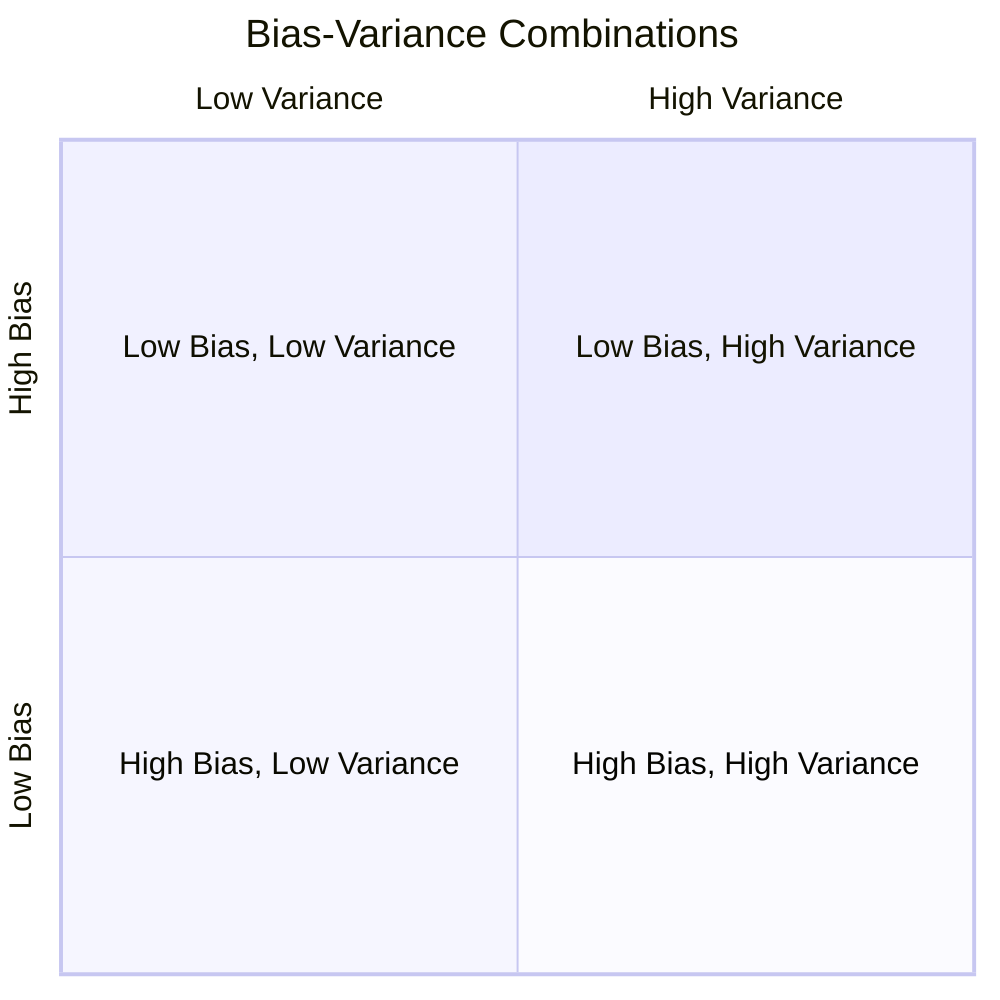

> [!NOTE] Definition
> The bias-variance tradeoff states that the expected prediction error of a model decomposes into three components: **irreducible noise**, **bias** (systematic error), and **variance** (sensitivity to training data). Reducing one typically increases the other.

## Formal Decomposition

Assume $Y = f(x) + \epsilon$ with $E(\epsilon) = 0$ and $Var(\epsilon) = \sigma^2$. The expected prediction error at a point $x_0$ decomposes as:

$$EPE(x_0) = \sigma^2 + \underbrace{E_\mathcal{T}((f(x_0) - E_\mathcal{T}(\hat{y}_0))^2)}_{\text{Bias}^2} + \underbrace{E_\mathcal{T}((E_\mathcal{T}(\hat{y}_0) - \hat{y}_0)^2)}_{\text{Variance}}$$

| Component | Meaning |
|-----------|---------|
| $\sigma^2$ (Noise) | Irreducible error from data measurement; independent of model |
| Bias$^2$ | Systematic deviation; independent of training set, 0 for a perfect learner |
| Variance | Sensitivity to specific training set; 0 for a model that always predicts the same |

## Intuition

The classic dartboard analogy illustrates the four cases:

- **High bias, low variance**: consistently wrong in the same way (e.g., underfitting linear model)
- **Low bias, high variance**: predictions scatter widely but are centered correctly (e.g., kNN with $k=1$)
- **Low bias, low variance**: the ideal - accurate and consistent

## For kNN

In [[K-Nearest Neighbors]]:
- Dense, well-populated neighborhoods produce **low bias** (good local approximation)
- In high dimensions ([[Curse of Dimensionality]]), neighborhoods vary wildly across training sets, causing **high variance**

## For Linear Models

In [[Linear Regression]] the expected in-sample error averaged over all $x_i$ is:

$$\frac{1}{N}\sum_{i=1}^{N} Err(x_i) = \sigma^2_\epsilon + \frac{p}{N}\sigma^2_\epsilon + \frac{1}{N}\sum_{i=1}^{N}\left[f(\vec{x}_i) - E\hat{f}(\vec{x}_i)\right]^2$$

The variance term $\frac{p}{N}\sigma^2_\epsilon$ grows with the number of features $p$ and shrinks with more data $N$.

> [!IMPORTANT]
> Model complexity controls the tradeoff. As complexity increases: bias decreases (better fit), variance increases (more sensitive to training data). The optimal model minimizes their sum.

## Related Concepts

- [[Overfitting]]: corresponds to low bias, high variance
- [[Cross-Validation]]: estimates the total error to find the best complexity
- [[Loss Functions in Machine Learning]]: the error being decomposed
- [[Expected Prediction Error]]: the quantity being minimized
