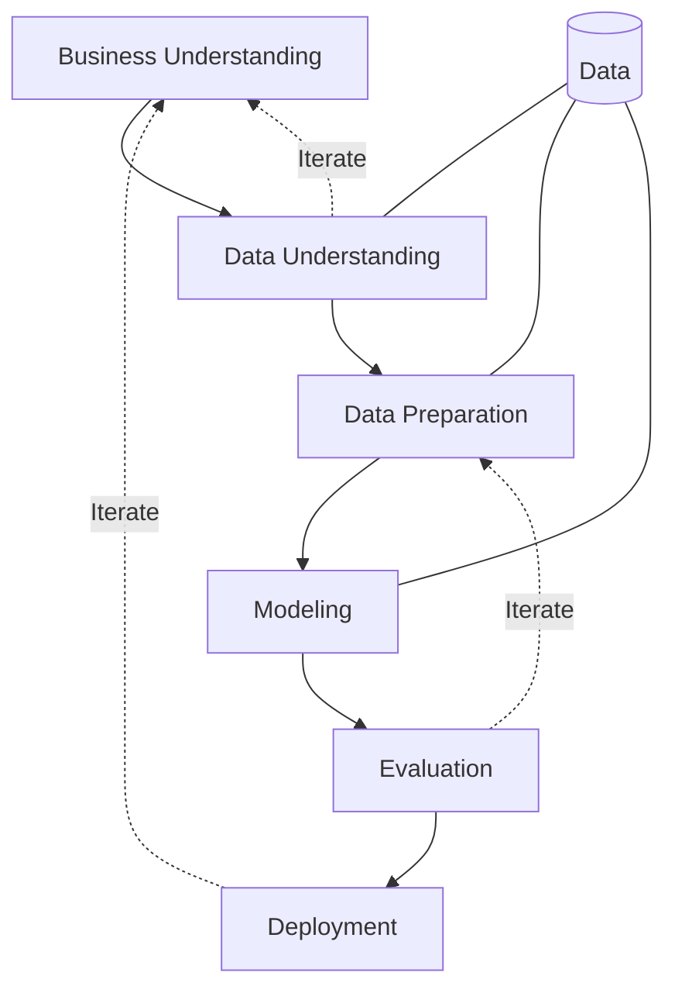

> [!NOTE] Definition
> CRISP-DM (Cross-Industry Standard Process for Data Mining) is an iterative process model that describes the complete lifecycle of a data mining project in six phases. It is the most widely used methodology for structuring data science work.

## Phases

| Phase | Activities |
|-------|-----------|
| **Business Understanding** | Define analysis goals, assess situation, set data analysis objectives, create project plan |
| **Data Understanding** | Collect, describe, explore data; assess raw data quality |
| **Data Preparation** | Select, clean, transform variables; handle inclusion/exclusion |
| **Modeling** | Choose methods and test design, estimate parameters, assess model quality |
| **Evaluation** | Accept/reject model, review process, determine next steps |
| **Deployment** | Create application and maintenance plan, presentation, final report |

> [!IMPORTANT]
> CRISP-DM is explicitly **iterative** - arrows go backward between phases. Insights from later phases (e.g., evaluation reveals data quality issues) feed back into earlier ones.

## Related Concepts

- [[Cross-Validation]]: a key technique in the Modeling and Evaluation phases
- [[Loss Functions in Machine Learning]]: used in the Modeling phase to assess model quality
