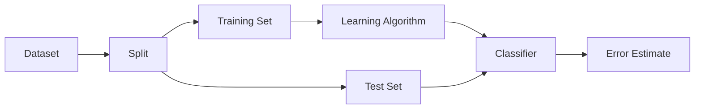

> [!NOTE] Definition
> Cross-validation is a model evaluation technique that partitions the available data into complementary training and test subsets multiple times, training and evaluating the model on each partition to obtain a robust estimate of generalization performance.

## Why Not Just Train-Test Split?

A simple train-test split divides data into:
- **Training set**: used to fit the model
- **Test set**: used to evaluate the model

The problem: the split may be unlucky - we might train on outliers and test on normal cases (or vice versa). Cross-validation addresses this by repeating the split multiple times.

## k-Fold Cross-Validation

The dataset is randomly divided into $k$ equally sized folds. In each iteration:
1. One fold serves as the test set
2. The remaining $k-1$ folds serve as the training set
3. The model is trained and evaluated

This is repeated $k$ times (each fold serves as test set exactly once). The final error estimate is the average across all $k$ folds.

> [!IMPORTANT]
> Common choices are $k = 5$ or $k = 10$. These provide a good balance between computational cost and estimation reliability.

## Leave-One-Out Cross-Validation (LOOCV)

A special case where $k = N$ (number of data points):
- Train on $N-1$ examples, test on the 1 left-out example
- Repeat $N$ times, sum all errors

LOOCV gives an almost unbiased estimate but is computationally expensive since the model must be trained $N$ times.

## Use Cases

Cross-validation is used to:
- Select the best hyperparameter (e.g., $k$ in [[K-Nearest Neighbors]])
- Compare different model types
- Estimate the expected generalization error without a separate test set

## Related Concepts

- [[Overfitting]]: cross-validation detects and prevents overfitting
- [[Bias-Variance Tradeoff]]: cross-validation helps find the optimal model complexity
- [[K-Nearest Neighbors]]: cross-validation is used to select the optimal $k$
- [[CRISP-DM]]: model evaluation is a key phase in the data mining process
