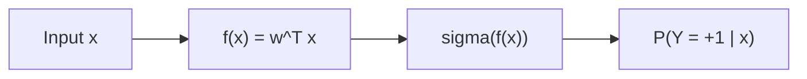

> [!NOTE] Definition
> Logistic regression is a classification method that models the probability of a binary outcome using a linear decision function passed through the sigmoid (logistic) function. Despite its name, it is used for [[Classification and Regression|classification]], not regression.

## How It Works

### Decision Function

A linear model computes a score for each input:

$$f(\mathbf{x}) = \mathbf{w}^T \mathbf{x} = \sum_{i=1}^{n} w_i x_i$$

The larger $f(\mathbf{x})$, the more likely $\mathbf{x}$ belongs to class $+1$.

### Sigmoid Function

The sigmoid transforms the score into a probability in $[0, 1]$:

$$\sigma(f(x)) = \frac{1}{1 + \exp(-f(x))}$$

### Log-Odds Interpretation

The model assumes the log-odds of the positive class are a linear function:

$$\log \frac{P(Y = +1)}{1 - P(Y = +1)} = f_w(\mathbf{x}_i)$$

### Classification Decision

Given a threshold $\theta$:

$$\text{Prediction} = \begin{cases} +1 & \text{if } f(\mathbf{x}) \geq \theta \\ -1 & \text{otherwise} \end{cases}$$

> [!IMPORTANT]
> The threshold $\theta$ controls the tradeoff between false positives and false negatives. Its optimal value depends on the misclassification costs. This tradeoff is analyzed using [[ROC Curve|ROC curves]].

## Training

Logistic regression is trained using [[Maximum Likelihood Estimation]] with the cross-entropy loss, since the normal distribution assumption does not apply to classification outputs.

## Related Concepts

- [[Linear Regression]]: the regression counterpart using a continuous output
- [[Classification and Regression]]: logistic regression is a classification method
- [[Maximum Likelihood Estimation]]: used to train logistic regression
- [[ROC Curve]]: evaluates the classifier across different thresholds
- [[Confusion Matrix]]: summarizes classification results for a specific threshold
