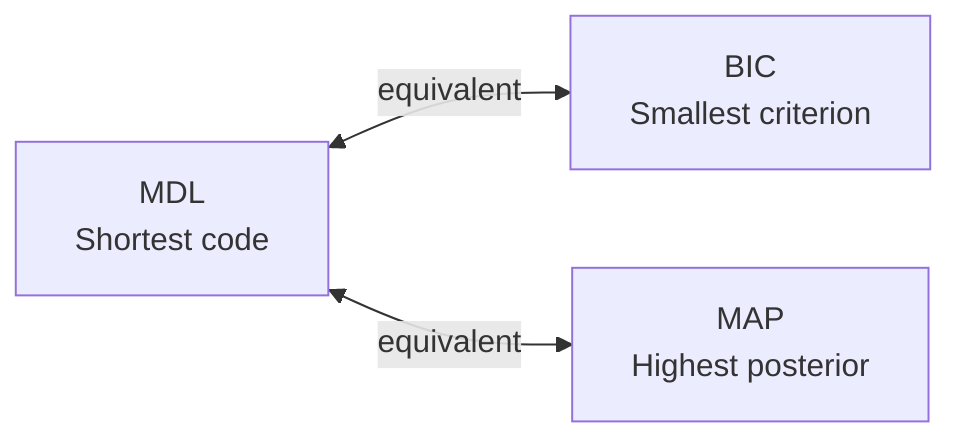

> [!NOTE] Definition
> The Minimum Description Length (MDL) principle states: choose the model that allows the shortest total encoding of both the model itself and the data given the model. It provides an information-theoretic perspective on model selection.

## Information-Theoretic Foundation

### Shannon's Coding Theorem

For a message $z_i$ with probability $Pr(z_i)$, the optimal code length is:

$$l_i = -\log_2 Pr(z_i)$$

The expected message length (entropy) is:

$$length \geq -\sum_i Pr(z_i) \log_2(Pr(z_i))$$

More probable messages get shorter codes. This connects probability to description length.

## How It Works

Given a model $\mathcal{M}$ with parameters $\theta$, the sender knows $\mathbf{X}$ and must transmit $\mathbf{y}$. The total description length is:

$$length = -\log Pr(\mathbf{y} | \theta, \mathcal{M}, \mathbf{X}) - \log Pr(\theta | \mathcal{M})$$

| Component | Encodes | Effect |
|---|---|---|
| $-\log Pr(\mathbf{y} \| \theta, \mathcal{M}, \mathbf{X})$ | Data given the model | Favors models that fit data well |
| $-\log Pr(\theta \| \mathcal{M})$ | The model parameters | Penalizes complex models |

> [!IMPORTANT]
> The MDL principle always selects the model with the shortest total message length, balancing data fit against model complexity.

## Properties

For normally distributed $y$ and $\theta$, with $\sigma$ controlling model complexity:

$$length = \log \sigma + \frac{(y - \theta)^2}{\sigma^2} + \frac{\theta^2}{2}$$

Smaller $\sigma$ means shorter messages and simpler models.

## Connection to BIC

Minimizing the MDL description length:

$$-\log Pr(\mathbf{y} | \theta, \mathcal{M}, \mathbf{X}) - \log Pr(\theta | \mathcal{M})$$

is equivalent to maximizing the posterior probability $Pr(\mathbf{y} | \mathbf{X})$. Therefore, minimizing BIC achieves the same model selection as the MDL principle.

## Related Concepts

- [[Bayesian Information Criterion]]: the statistical criterion equivalent to MDL
- [[Maximum Likelihood Estimation]]: MDL's data-fit term is the negative log-likelihood
- [[Cross-Validation]]: alternative model selection via error estimation
