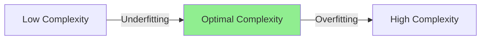

> [!NOTE] Definition
> Overfitting occurs when a model fits the training data too closely - including its noise and random fluctuations - resulting in low training error but high error on unseen test data. The model essentially "memorizes" the training examples rather than learning the underlying pattern.

## How It Works

A model that overfits has high **complexity** relative to the amount of training data. It captures patterns that are specific to the training set but do not generalize.

In [[K-Nearest Neighbors]]:
- $k = 1$: the model assigns each point the label of its single closest neighbor. Training error is **zero** (each point is its own nearest neighbor), but test error is typically high
- $k = 15$: smoother decision boundaries, better generalization but potentially higher training error

> [!WARNING]
> Just because a model achieves zero training error does not mean it has learned well. Memorization is not generalization.

## Example

Consider a kNN classifier on 2D data:
- With $k = 1$: the decision boundary is extremely jagged, wrapping around every training point. It perfectly classifies all training examples but produces irregular, non-generalizable boundaries
- With $k = 15$: the decision boundary is smoother and captures the actual class separation better, even though some training points are misclassified

## Detection and Prevention

Overfitting is detected by comparing training error vs. test error. Methods to prevent it:

| Method | How it helps |
|--------|-------------|
| [[Cross-Validation]] | Estimates generalization error without wasting data |
| Regularization | Penalizes model complexity |
| More training data | Reduces the chance of fitting noise |
| Simpler models | Fewer parameters means less capacity to memorize |

## Related Concepts

- [[Bias-Variance Tradeoff]]: overfitting corresponds to low bias but high variance
- [[Cross-Validation]]: primary tool for detecting and mitigating overfitting
- [[Curse of Dimensionality]]: exacerbates overfitting in high-dimensional spaces
- [[K-Nearest Neighbors]]: the parameter $k$ directly controls overfitting
