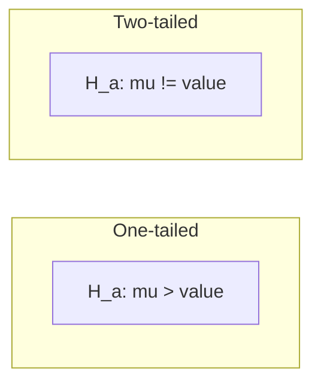

> [!NOTE] Definition
> The sign test is a simple non-parametric statistical test used to determine whether one learning algorithm is significantly better than another by counting wins and losses across multiple datasets.

## Why We Need Statistical Tests

When comparing algorithms A and B on $m$ datasets:
- Average performance can be misleading (A might be 0.1% better on 19 large datasets, but B is 2% better on 1 small dataset)
- We need to ask: is the observed difference statistically significant?

## How It Works

### Analogy to Coin Flipping

The sign test models algorithm comparison as a fair coin toss:
- Each dataset is a "coin flip"
- A win for algorithm A = heads, a win for B = tails
- Ties are discarded
- **Null hypothesis** $H_0$: both algorithms are equal, i.e., $P(\text{heads}) = P(\text{tails}) = 0.5$

### Formal Setup

With $N$ datasets (ties removed), if algorithm A wins $i$ times:

$$P(i) = \binom{N}{i} p^i (1-p)^{N-1}$$

where $p = 0.5$ under $H_0$ (binomial distribution).

### One-Tailed vs Two-Tailed

| Test Type | Tests Whether | P-value |
|---|---|---|
| **One-tailed** | A is better than B (or vice versa) | $P(i \leq k) = \frac{1}{2^N} \sum_{j=1}^{k} \binom{N}{j}$ |
| **Two-tailed** | A and B are different | Sum of both tails |

## Example

Comparing algorithms A and B on 20 datasets:
- A wins 4 times, B wins 14 times, 2 ties
- $N = 18$ (after removing ties)
- At 95% confidence: B is significantly better
- At 99% confidence: not significant

## Properties

> [!IMPORTANT]
> The sign test is very **conservative** - it makes no assumptions about the underlying distribution. If it finds no significant difference, a more powerful test (like the t-test) might still detect one.

| Property | Sign Test | t-Test |
|---|---|---|
| Assumption | None | Normal distribution of differences |
| Answers | "How often does A win?" | "How large is the difference?" |
| Power | Lower | Higher |
| Robustness | Very robust | Sensitive to outliers |

## Related Concepts

- [[Confusion Matrix]]: provides the per-dataset accuracy used for comparison
- [[Cross-Validation]]: generates the performance estimates compared by the sign test
