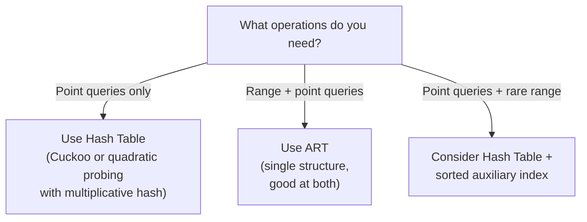

> [!NOTE] Definition
> This note summarizes the findings of Alvarez, Richter, Chen, and Dittrich (ICDE 2015), who compared [[Adaptive Radix Tree|ART]] against Judy arrays and several modern hash table implementations. Their key conclusion: well-engineered hash tables outperform ART by 2.8-4.8x for point queries, challenging the original ART paper's performance claims.

**Paper:** Alvarez, Richter, Chen, Dittrich - "A Comparison of Adaptive Radix Trees and Hash Tables" (ICDE 2015)

## Motivation

The original [[Adaptive Radix Tree|ART]] paper (Leis et al., ICDE 2013) reported ART matching or outperforming hash tables for point queries. This study re-evaluates that claim using:
- More hash table variants (Cuckoo hashing, Robin Hood, Google dense/sparse hash)
- Different hash functions (multiplicative hashing vs MurmurHash)
- Larger datasets (up to 1 billion keys)
- Judy arrays as an additional adaptive trie competitor

## Competitors

### Hash Tables Tested

| Hash Table | Probing Strategy | Key Feature |
|---|---|---|
| **Chained** | Separate chaining | Baseline, cache-unfriendly |
| **Google Dense** | Quadratic probing | Widely used, good all-around |
| **Google Sparse** | Quadratic probing | Space-optimized variant |
| **Cuckoo (Bucket)** | Two hash functions, 4-slot buckets | Worst-case $O(1)$ lookup |
| **Robin Hood** | Linear probing, displacement-based | Reduces probe variance |

### Tries Tested

| Trie | Description |
|---|---|
| **ART** | [[Adaptive Radix Tree]] with 4 node types |
| **Judy** | HP's 256-ary trie with compressed nodes and cache-line optimization |

## Key Findings

### 1. Hash Tables Beat ART for Point Queries

At 1 billion 64-bit keys:

| Operation | Best Hash Table | vs ART |
|---|---|---|
| Insertion | CHFast-Simple (Cuckoo) | **4.8x faster** |
| Positive lookup | CHFast-Simple | **2.8x faster** |
| Negative lookup | CHFast-Simple | **3.5x faster** |
| Deletion | Google Dense | **2.5x faster** |

> [!IMPORTANT]
> The performance gap widens with dataset size. At smaller datasets (millions of keys), the difference is smaller. At 1B keys, hash tables dominate decisively for all point operations.

### 2. Hash Function Choice Matters Enormously

The study found that the hash function has a larger impact on hash table performance than the collision resolution strategy:

| Hash Function | Speed | Quality | Best For |
|---|---|---|---|
| **Multiplicative** | Very fast (multiply + shift) | Adequate for integer keys | In-memory databases |
| **MurmurHash** | Slower (multiple rounds) | Excellent distribution | General purpose |
| **Tabulation** | Fast (XOR of lookups) | Good | Alternative to multiplicative |

> [!WARNING]
> The original ART paper used MurmurHash for its hash table baselines. Switching to multiplicative hashing alone made hash tables significantly faster, partially explaining why ART appeared competitive in the original evaluation.

### 3. Judy Arrays Fall Between ART and Hash Tables

Judy arrays use cache-line-sized nodes and different compression strategies than ART. Results:
- **Faster than ART** for point queries (especially negative lookups)
- **Slower than good hash tables** for all point operations
- More complex implementation than ART

### 4. ART Retains Range Query Advantage

Hash tables fundamentally cannot support:
- Range iteration
- Prefix lookup
- Ordered traversal
- Min/Max queries

For workloads requiring both point and range queries, ART remains a strong choice because it handles both with a single data structure.

## Space Efficiency

| Structure | Bytes/key (1B keys) |
|---|---|
| ART | ~25-30 |
| Judy | ~18-22 |
| Cuckoo Hash (4-slot) | ~12-16 |
| Google Dense | ~16-24 (load-factor dependent) |

Hash tables generally use less space than tries for integer keys because they store keys contiguously without tree overhead.

## Practical Implications

> [!IMPORTANT]
> **Takeaway for database system design:**
> - If your workload is OLTP with mixed point/range queries, [[Adaptive Radix Tree|ART]] is a strong unified index
> - If your workload is dominated by point lookups (key-value stores, hash joins), a well-tuned hash table with multiplicative hashing will be significantly faster
> - Never benchmark hash tables with a slow hash function - it distorts the comparison

## Related Concepts

- [[Adaptive Radix Tree]]: the index structure being evaluated
- [[CSB+ Tree]]: another cache-conscious tree index
- [[B+ Tree Latch Coupling]]: concurrency for tree-based indexes
- [[CSS-Tree]]: read-only cache-sensitive search tree for OLAP
