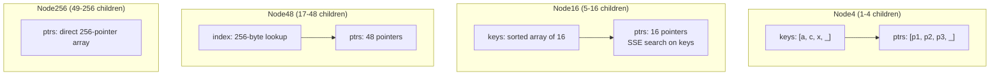

> [!NOTE] Definition
> The Adaptive Radix Tree (ART) is a radix tree variant designed for main-memory databases. Unlike fixed-fan-out trees, ART dynamically adapts each node's internal representation to the number of children it has, using four node types (Node4, Node16, Node48, Node256). This achieves near-optimal space usage while maintaining $O(k)$ lookup time, where $k$ is the key length.

**Paper:** Leis, Kemper, Neumann - "The Adaptive Radix Tree: ARTful Indexing for Main-Memory Databases" (ICDE 2013)

## Why Not Traditional Indexes?

Comparison-based indexes like [[B+ Tree Latch Coupling|B+ Trees]] and T-Trees were designed for disk-based systems. In main memory:
- **Cache misses** dominate performance, not disk I/O
- B+ Trees still have $O(\log n)$ comparisons and poor cache behavior on keys
- Hash tables provide $O(1)$ point queries but cannot support range queries or sorted iteration

ART targets the sweet spot: **near-hash-table speed for point queries + full order-preserving operations** (range scans, prefix lookups, min/max).

## Radix Tree Basics

A radix tree (trie) indexes keys by their byte-wise decomposition rather than by comparison. Each level of the tree examines one byte of the key, giving a fixed span of 256 possible children per node.

| Property | Comparison Tree (B+ Tree) | Radix Tree (ART) |
|---|---|---|
| Lookup complexity | $O(\log n)$ comparisons | $O(k)$ - key length only |
| Key ordering | Yes | Yes (with binary-comparable keys) |
| Shape depends on | Insert order | Key distribution |
| Range queries | Yes | Yes |

> [!IMPORTANT]
> ART's height and lookup cost depend only on key length $k$, not on the number of stored keys $n$. This means performance does not degrade as the dataset grows.

## Adaptive Node Types

The key innovation: instead of always allocating space for 256 children, ART uses four node types that grow as needed:

| Node Type | Children | Structure | Space |
|---|---|---|---|
| **Node4** | 1-4 | Sorted array of 4 keys + 4 child pointers | 52 bytes |
| **Node16** | 5-16 | Sorted array of 16 keys + 16 child pointers | 160 bytes |
| **Node48** | 17-48 | 256-entry index array (1 byte each) + 48 child pointers | 656 bytes |
| **Node256** | 49-256 | Direct 256-pointer array | 2048 bytes |

**Lookup in each node type:**
- **Node4**: linear scan of 4 keys (fits in a cache line)
- **Node16**: [[SIMD Processing|SIMD]] parallel comparison of 16 keys using `_mm_cmpeq_epi8`
- **Node48**: single byte lookup in index array, then pointer dereference
- **Node256**: direct array access by key byte - single pointer dereference

When a node overflows, it is **grown** to the next size (e.g., Node4 to Node16). When it shrinks below the minimum, it is **shrunk** to the smaller type.

## Path Compression

ART uses two techniques to collapse chains of single-child nodes:

### Lazy Expansion
When inserting a key, ART does not create inner nodes for parts of the key that are unambiguous. A leaf is stored at the highest node where no other key shares its prefix. Inner nodes are only created when two keys diverge.

### Pessimistic Path Compression
When a chain of single-child nodes exists, ART stores the shared prefix bytes directly in the node (up to 8 bytes). If the prefix exceeds 8 bytes, only the first 8 are stored and the rest are verified against the actual key in the leaf (pessimistic approach).

> [!NOTE]
> Pessimistic path compression avoids storing full keys in every inner node, saving significant space. The tradeoff is an extra leaf access when prefixes exceed 8 bytes - but this is rare in practice.

## Binary-Comparable Keys

For ART to support order-preserving operations, keys must be transformed so that **byte-wise comparison equals semantic comparison**:

| Data Type | Transformation |
|---|---|
| Unsigned integers | Big-endian byte order |
| Signed integers | Flip sign bit, then big-endian |
| Floats (IEEE 754) | Flip sign bit; if negative, flip all bits |
| Strings | Null-terminated (0x00 suffix) |
| Compound keys | Concatenate transformed components |

## Space Efficiency

Worst-case space consumption per key: **52 bytes** (when every node is Node4 with exactly one child down to the leaf). In practice, space usage is much lower due to path compression and node sharing.

| Dataset | Bytes/key (ART) | Bytes/key (CSB+ Tree) |
|---|---|---|
| Dense integers | 8.1 | 17.0 |
| Sparse integers | 29.1 | 28.8 |
| 20-char strings | 30.7 | 45.3 |

> [!IMPORTANT]
> ART is particularly space-efficient for dense keys (like auto-increment IDs) due to extensive prefix sharing. For sparse keys, it approaches but does not exceed B+ Tree space usage.

## Performance Evaluation

### Point Queries (Single Threaded)

| Index | Dense Keys | Sparse Keys |
|---|---|---|
| ART | Fastest | Near-fastest |
| [[CSB+ Tree]] | ~2x slower | Comparable |
| Hash Table (Cuckoo) | Comparable | Comparable |
| Red-Black Tree | ~4x slower | ~3x slower |

### Range Queries

ART significantly outperforms hash tables for range scans and supports operations like:
- Range iteration (in-order traversal)
- Prefix lookup
- Minimum / Maximum

### TPC-C Integration (HyPer)

When integrated into the HyPer main-memory DBMS, replacing a combination of hash table (point queries) + red-black tree (range queries):
- **2x faster** than hash + red-black tree combined
- **4x faster** than red-black tree alone
- Single unified index handles both point and range queries

## Concurrency

The original paper does not address concurrent access. Later work (Optimistic Lock Coupling, ROWEX) extends ART for multi-threaded OLTP - see [[B+ Tree Latch Coupling]] for the general latch coupling approach that can be adapted to ART.

## Related Concepts

- [[CSB+ Tree]]: cache-optimized B+ Tree variant compared against ART
- [[CSS-Tree]]: read-only cache-sensitive tree for OLAP
- [[B+ Tree Latch Coupling]]: concurrency control applicable to tree indexes
- [[SIMD Processing]]: used in Node16 key lookup via SSE comparison
- [[ART vs Hash Tables]]: follow-up study comparing ART against modern hash tables
- [[Column Imprints]]: alternative lightweight OLAP index
- [[Zone Maps]]: coarse-grained index for scan filtering
