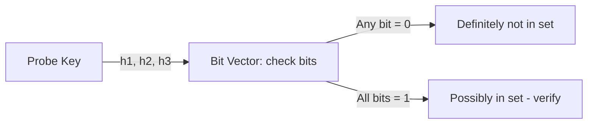

> [!NOTE] Definition
> A Bloom filter is an approximate, bit-vector-based data structure that checks whether a key is contained in a set of keys, using much less memory than storing the keys themselves, at the cost of possible false positives.

## How It Works

A Bloom filter is a bit vector of size $m$ (much smaller than the number of keys) combined with $k$ independent hash functions.

**Insert:** for a key, compute all $k$ hash values and set the corresponding bits to 1.

**Probe:** for a key, compute all $k$ hash values and check whether all corresponding bits are set to 1.
- If **any** bit is 0, the key is **definitely not** in the set
- If **all** bits are 1, the key is **probably** in the set (or it is a false positive)

## Example

With a bit vector of size 5 and three hash functions $h_1(k) = k \bmod 3$, $h_2(k) = k \bmod 6$, $h_3(k) = k \bmod 7$, inserting keys sets the bits at the computed indices to 1. When probing a key that was never inserted, if all three of its hash positions happen to already be set (by other keys), the filter reports a **false positive** - it never produces a false negative.

## Use in Databases: Efficient Probing

Joins commonly probe for tuples that have **no** matching join partner - most hash table lookups end up negative. A Bloom filter can be embedded directly in a hash table's directory (using otherwise-unused lower bits as a filter) to reject non-matching probes immediately, without ever traversing the actual linked list of tuples, dramatically speeding up the common negative-lookup case.

> [!IMPORTANT]
> A Bloom filter never produces false negatives - if it reports "not present," the key is guaranteed absent. It can only be wrong in the "possibly present" direction, so a positive result still requires verification against the real data.

## Related Concepts

- [[Parallel Hash Table Construction]]: uses Bloom filter bits to speed up the probe phase
- [[Partition-Based Hash Join]]: benefits from fast rejection of non-matching probe tuples
