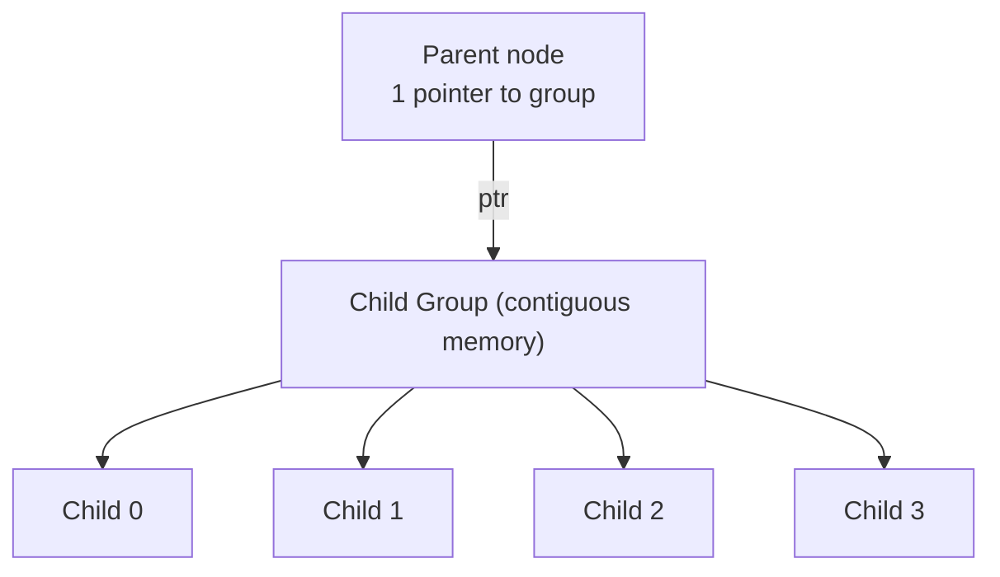

> [!NOTE] Definition
> The CSB+ Tree (Cache-Sensitive B+ Tree) improves upon the [[CSS-Tree]] by supporting updates while maintaining good cache behavior. Instead of eliminating pointers entirely, it stores all children of a node in a contiguous memory block (node group), requiring only **one pointer** to the first child.

## Key Idea

In a standard B+ Tree with $m$ children per node:
- **Standard B+ Tree**: $m$ pointers per node (one per child)
- **CSB+ Tree**: 1 pointer per node (to the start of the child group)

The $i$-th child is found at `firstChild + i * nodeSize` - simple pointer arithmetic.

## Comparison

| Property | B+ Tree | CSS-Tree | CSB+ Tree |
|---|---|---|---|
| Pointers per node | $m$ | 0 | 1 |
| Supports updates | Yes | No | Yes |
| Keys per cache line | Fewest | Most | More than B+ Tree |
| Node splits | Standard | N/A | Must copy entire group |

## Update Handling

When a child node splits:
1. Allocate a new, larger contiguous block for the child group
2. Copy existing children and insert the new node
3. Update the parent's single pointer to the new group

> [!IMPORTANT]
> The main trade-off: node splits are more expensive than in a standard B+ Tree because the entire child group must be reallocated and copied. This is acceptable when reads greatly outnumber writes.

## Segmented Variants

To reduce the cost of node splits, segmented CSB+ Trees divide each node group into segments:
- Splits only require reallocating one segment instead of the entire group
- Trade-off: slightly worse cache behavior due to additional pointer per segment

## Related Concepts

- [[CSS-Tree]]: the read-only predecessor that eliminates all pointers
- [[B+ Tree Latch Coupling]]: concurrency control for B+ tree variants
- [[Memory Hierarchy]]: the cache behavior CSB+ Trees optimize
