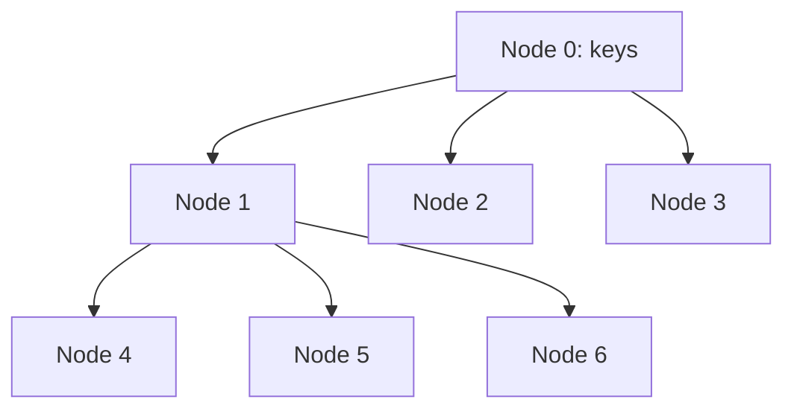

> [!NOTE] Definition
> The CSS-Tree (Cache-Sensitive Search Tree) is a read-only index structure designed for OLAP workloads. It eliminates pointers entirely by storing all nodes in a flat array, using arithmetic to compute child positions. This maximizes cache line utilization during tree traversal.

## Motivation

Traditional B+ Trees waste cache space on pointers:
- Each pointer is 8 bytes (64-bit systems)
- A cache line is 64 bytes
- With pointers, fewer keys fit per cache line, causing more cache misses during traversal

## How It Works

The CSS-Tree packs nodes contiguously in a flat array. For a node with $m$ keys at position $b$:

$$\text{Children at positions: } b \cdot (m+1) + 1 \text{ to } b \cdot (m+1) + (m+1)$$

All nodes are stored sequentially in memory - no pointers needed.

## Properties

| Property | CSS-Tree | B+ Tree |
|---|---|---|
| Pointers per node | 0 | $m+1$ |
| Keys per cache line | More | Fewer |
| Updates | Not supported | Supported |
| Lookup performance | Better (fewer cache misses) | Good |
| Use case | OLAP (read-heavy) | OLTP (read-write) |

## Construction

1. Sort all keys
2. Build the tree bottom-up into a contiguous array
3. Node positions implicitly encode the tree structure

> [!IMPORTANT]
> The CSS-Tree is a **static** structure - it does not support insertions or deletions. When the underlying data changes, the entire tree must be rebuilt. This makes it suitable only for read-heavy OLAP workloads where data is batch-loaded.

## Cache Behavior

With $m$ keys per node fitting in one cache line:
- Each level of the tree = one cache miss
- Search cost: $\log_{m+1}(n)$ cache misses for $n$ keys
- Compare to binary search: $\log_2(n)$ cache misses

For $m = 15$ (fitting 15 x 4-byte keys in 64 bytes): search over 1M keys takes ~5 cache misses vs ~20 for binary search.

## Related Concepts

- [[CSB+ Tree]]: updatable variant that uses one pointer per node group
- [[Memory Hierarchy]]: the cache architecture CSS-Trees optimize for
- [[Column Store]]: OLAP workloads that benefit from CSS-Trees
