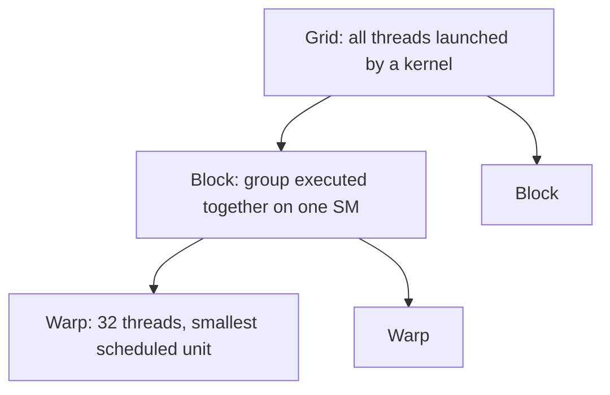

> [!NOTE] Definition
> CUDA (Compute Unified Device Architecture) is NVIDIA's programming model for GPUs, in which a **kernel** function is launched across a **grid** of thread **blocks**, each block executed on one Streaming Multiprocessor and internally scheduled in fixed-size units of 32 threads called **warps**.

Other GPU programming APIs exist - OpenCL is the vendor-neutral industry standard (compiles for CPU, GPU, DSP, FPGA), and OpenMP/OpenACC offer directive-based parallelism - but CUDA terminology is the most common reference point for NVIDIA hardware.

## Execution Model: CPU vs. GPU

| | CPU Threads | GPU Threads |
|---|---|---|
| **Weight** | Relatively heavyweight | Lightweight |
| **Management** | Each thread managed explicitly | Threads scheduled in batches (warps) |
| **Code** | Threads can run different code | All threads in a warp run the *same* instruction - similar to [[SIMD Processing|SIMD]] |
| **Philosophy** | "Do one (few) thing(s) fast" | "Do many same things fast" |

## Grid / Block / Warp Hierarchy

| Term | Definition |
|---|---|
| **Grid** | The full bulk of threads launched on the device by one kernel call |
| **Block** | A group of threads executed together on one SM (e.g., 512 threads); ideally `#blocks x threads/block >= problem size` |
| **Warp** | The smallest physically scheduled unit - always 32 threads, not explicitly declared by the programmer |

A kernel is a function executed by parallel threads in a grid, launched with two parameters: the number of blocks and the number of threads per block, e.g. `vectorAdd<<<numBlocks, threadsPerBlock>>>(A, B, C, N)`. Inside the kernel, `blockIdx`, `blockDim`, and `threadIdx` let each thread compute its own data index.

## Scheduling

- All threads in a block are scheduled on **one** SM
- More than one block can run concurrently per SM, depending on thread count and resource demands
- Each cycle, one or more active warps are advanced; all threads within a warp execute the same instruction in lockstep (SIMD-like)
- Newer architectures advance more warps per cycle (e.g., Volta: 2, Blackwell: 4)

## Thread Synchronization

> [!IMPORTANT]
> There is **no global ordering guarantee** inside a kernel: threads run in parallel, and there is no guarantee one block finishes before another. Even within a block, synchronization is limited.

| Scope | Mechanism |
|---|---|
| **Within a block** | `__syncthreads()` - all threads wait, and writes become visible to others in the block |
| **Within a block, fine-grained** | Atomics, to coordinate between threads and avoid race conditions |
| **Across blocks** | Not directly possible - must use **separate kernel calls** as an implicit synchronization point |

## Related Concepts

- [[GPU Architecture]]: the hardware this programming model targets
- [[Parallel Reduction and Prefix Sum]]: a canonical CUDA algorithm built on this grid/block/warp model
- [[SIMD Processing]]: warp-level execution is conceptually similar to SIMD lanes
