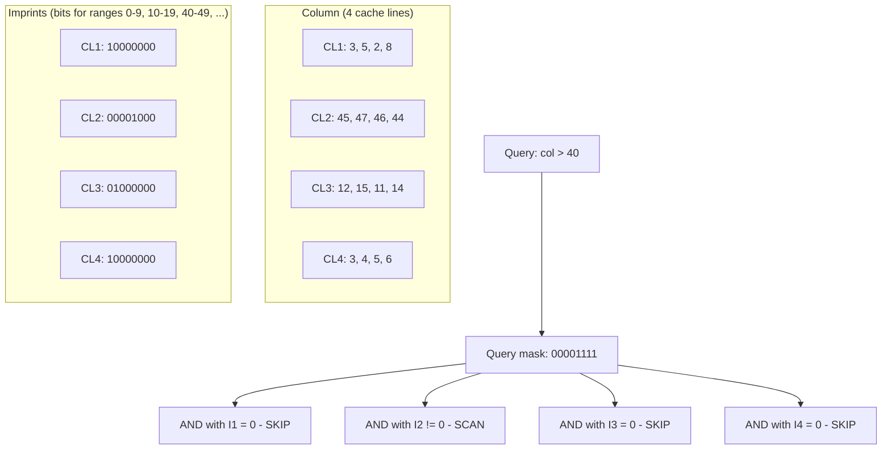

> [!NOTE] Definition
> Column imprints are a secondary index structure for [[Column Store]] systems. For each cache-line-sized block of a column, an imprint stores a small bit-vector indicating which value ranges are present in that block. During a scan, blocks whose imprint does not overlap with the query range are skipped entirely.

## How It Works

1. **Divide** the value domain into $b$ equal-width buckets (typically $b = 64$, one per bit)
2. **For each cache line** of the column, set bit $j = 1$ if any value in the cache line falls into bucket $j$
3. **At query time**, create a query bitmask with bits set for buckets that overlap the predicate range
4. **AND** the query bitmask with each imprint - if the result is zero, skip that cache line

## Properties

| Property | Value |
|---|---|
| Space overhead | ~1 bit per value (with 64 buckets per cache line of 16 int32 values = 64/16 = 4 bits, but compressed) |
| Granularity | Cache-line level |
| Update cost | Cheap (set additional bits, never unset) |
| False positives | Possible (bit set but no qualifying value) |
| False negatives | Never |

> [!IMPORTANT]
> Column imprints are designed to be **cache-resident** themselves. The imprint index for a column is much smaller than the column itself (roughly 1/8th to 1/64th the size), so it fits in cache even when the column does not.

## Compression of Imprints

Consecutive cache lines often have similar imprints (especially in sorted or clustered data). Run-length compression on the imprint bit-vectors further reduces their size.

## Comparison with Zone Maps

| Feature | Column Imprints | [[Zone Maps]] |
|---|---|---|
| Granularity | Cache line (~64 bytes) | Page/block (~4 KB+) |
| Information | Which ranges present | Min/max only |
| Space | Larger | Very small |
| Precision | Higher | Lower |

## Related Concepts

- [[Zone Maps]]: coarser-grained alternative using min/max per block
- [[Vectorized Scan]]: imprints determine which blocks to scan
- [[Column Store]]: the storage model imprints are designed for
- [[Predicate Evaluation]]: imprints accelerate predicate evaluation by skipping blocks
