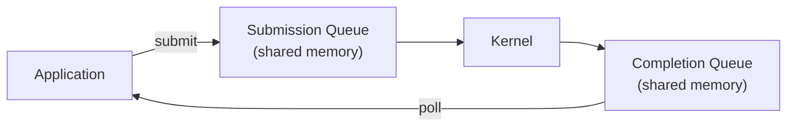

> [!NOTE] Definition
> Database systems can use different I/O interfaces to access NVMe SSDs, ranging from traditional synchronous POSIX calls to kernel-bypassing approaches like SPDK. The choice significantly impacts throughput and latency, especially with modern NVMe devices.

## Interface Comparison

| Interface | Sync/Async | Kernel involved? | Throughput | Complexity |
|---|---|---|---|---|
| **POSIX** (read/write) | Synchronous | Yes | Lowest | Simplest |
| **libaio** | Asynchronous | Yes (syscalls) | Medium | Medium |
| **io_uring** | Asynchronous | Yes (shared ring buffer) | High | Medium |
| **SPDK** | Asynchronous | No (kernel bypass) | Highest | Highest |

## POSIX (Synchronous I/O)

Traditional `read()`/`write()` system calls:
- Thread blocks until I/O completes
- Each I/O requires a syscall (context switch overhead)
- Simple but cannot saturate modern NVMe devices
- One outstanding request per thread

## libaio (Linux Async I/O)

Linux kernel asynchronous I/O:
- Submit I/O requests without blocking
- Poll for completions
- Still requires syscalls for submission and completion
- Requires O_DIRECT (bypasses page cache)

## io_uring

Modern Linux async I/O framework (kernel 5.1+):
- Uses shared ring buffers between user space and kernel
- **Submission queue** (SQ) and **completion queue** (CQ) in shared memory
- Batches submissions - fewer syscalls needed
- Supports both polled and interrupt-driven completion

## SPDK (Storage Performance Development Kit)

Intel's kernel-bypass framework:
- Moves the NVMe driver into **user space**
- No syscalls, no context switches, no interrupts
- Application polls the NVMe completion queue directly
- Achieves the lowest latency and highest throughput

> [!IMPORTANT]
> SPDK provides the best raw performance but at significant engineering cost: the application must manage its own memory, handle device errors, and cannot share the device with the OS. It dedicates the entire SSD to the application.

## Performance Implications for Databases

With NVMe SSDs providing ~10 us latency:
- POSIX syscall overhead (~1-2 us per call) is a significant fraction
- io_uring reduces this through batching
- SPDK eliminates it entirely

For [[LeanStore]] and similar NVMe-optimized storage engines, the choice of I/O interface directly impacts how many of the ~13,000 available CPU cycles per I/O are spent on software overhead vs. useful work.

## Related Concepts

- [[LeanStore]]: NVMe-optimized engine that benefits from fast I/O interfaces
- [[SSD Architecture]]: the NVMe hardware these interfaces access
- [[SSD Performance Characteristics]]: I/O interface choice affects observable performance
