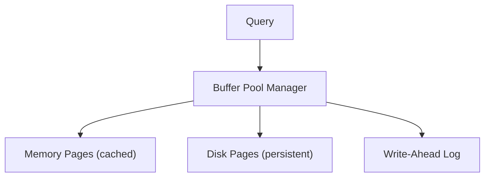
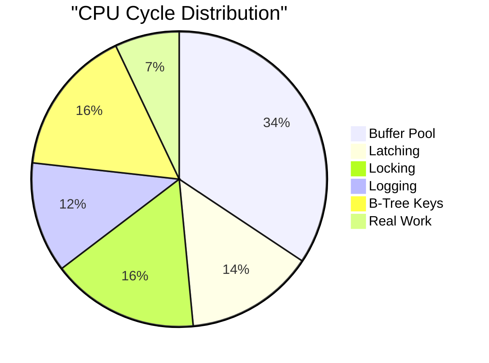

> [!NOTE] Definition
> A disk-based DBMS assumes that the primary storage medium is a disk (HDD or SSD). Data is organized in fixed-size pages on disk and cached in a memory buffer pool. All data access goes through the buffer pool manager, which handles page loading, eviction, and dirty page write-back.

## Architecture

The buffer pool manager:
1. Checks if the requested page is in memory
2. If not (page fault), loads it from disk
3. If memory is full, evicts a page using a replacement policy (LRU, Clock, etc.)
4. If the evicted page is dirty, writes it back to disk

## Overhead Breakdown

> [!IMPORTANT]
> Only about 7% of CPU cycles in a disk-based DBMS go to actual data processing. The overwhelming majority is spent on infrastructure to manage the disk-memory boundary. This is the key motivation for [[Main Memory DBMS]] systems.

## Assumptions

- Data is larger than available memory
- Disk I/O is the primary bottleneck
- Sequential disk access is much faster than random access
- Pages are the unit of transfer between disk and memory

These assumptions drove decades of database design (B-trees, large pages, sequential scans) but are increasingly challenged by large DRAM capacities and [[SSD Architecture|SSD]] characteristics.

## Related Concepts

- [[Main Memory DBMS]]: the alternative architecture assuming data fits in RAM
- [[SSD Performance Characteristics]]: SSDs change the disk access cost model
- [[SSD-Aware Database Design]]: adapting disk-based designs for SSD characteristics
