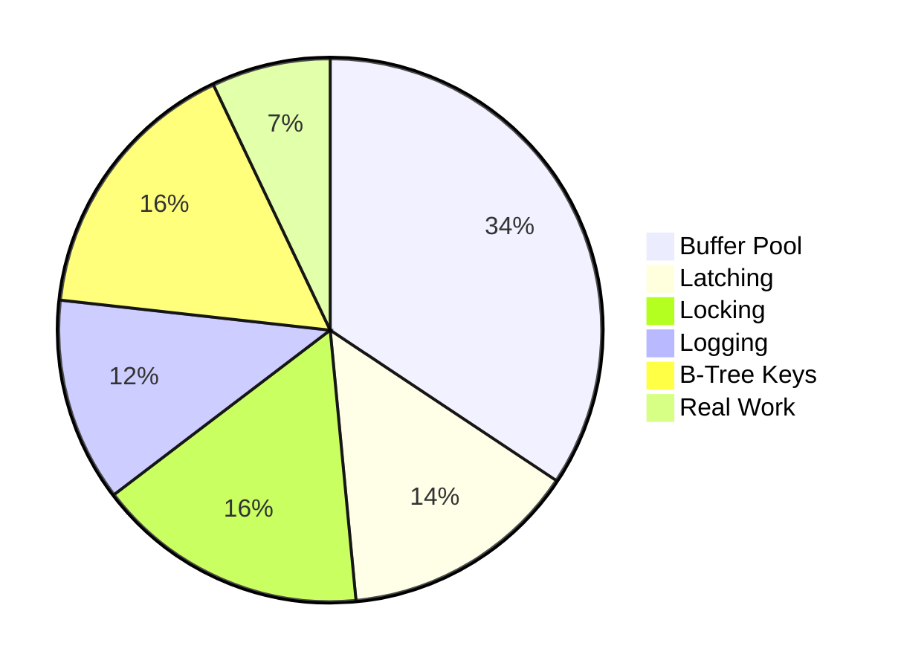

> [!NOTE] Definition
> A disk-based DBMS assumes that the primary storage medium is a disk (HDD or SSD). Data is organized in fixed-size pages on disk and cached in a memory buffer pool. All data access goes through the buffer pool manager, which handles page loading, eviction, and dirty page write-back.

## Overhead Breakdown

> [!IMPORTANT]
> Only about 7% of CPU cycles in a disk-based DBMS go to actual data processing. The overwhelming majority is spent on infrastructure to manage the disk-memory boundary. This is the key motivation for [[Main Memory DBMS]] systems.

## Observations
- Overhead comes from “indirections” even if page is already in the buffer
	- lookup cost in page table
	- calculating a memory pointer to the tuple
- There is an increasing gap between CPU & memory speeds leading to I/O wait
## Related Concepts

- [[Main Memory DBMS]]: the alternative architecture assuming data fits in RAM
- [[SSD Performance Characteristics]]: SSDs change the disk access cost model
- [[SSD-Aware Database Design]]: adapting disk-based designs for SSD characteristics
