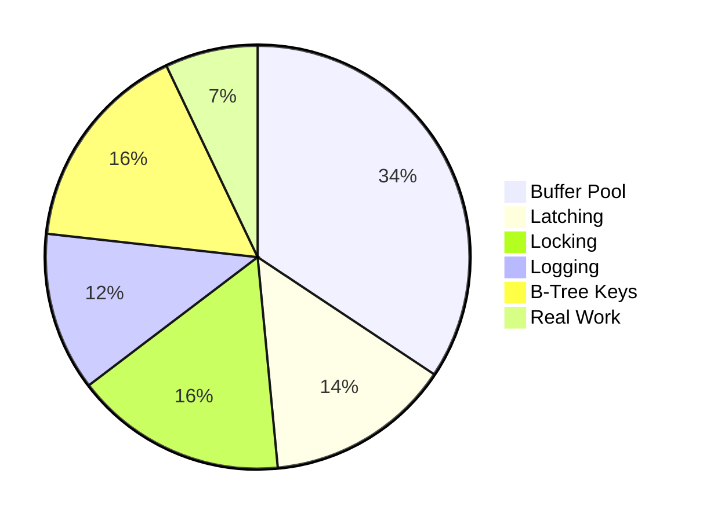

---
title:
aliases:
tags:
description: Traditional DBMS systems assume that the primary storage medium is a disk (HDD or SSD). Data is stored on disk pages and cached in a memory buffer pool.
draft: false
---
> [!NOTE] Definition
> Traditional DBMS systems assume that the primary storage medium is a disk (HDD or SSD). Data is stored on disk pages and cached in a memory buffer pool.
## Data Access
TODO

## Overhead

> [!IMPORTANT]
> Data access via Buffer pool causes highest overhead