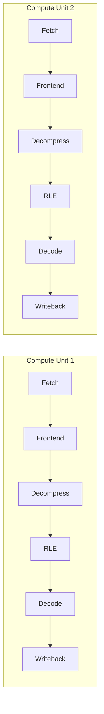

> [!NOTE] Definition
> FPGA-accelerated Parquet parsing offloads the CPU-expensive work of decompressing and decoding Parquet's on-disk columnar format into Arrow's in-memory columnar format onto an [[Field-Programmable Gate Array|FPGA]], freeing CPU cycles for actual query computation (BI, reporting, data science, ML).

## Motivation: Data Lakehouses

Modern data lakehouse systems store raw, often compressed structured/semi-structured/unstructured data and must repeatedly parse it before any real analytical work (BI, reports, data science, ML) can happen. Since that "actual useful work" is where compute should be spent, the parsing step is a prime candidate for offloading.

## Parquet vs. Arrow

Both formats are columnar, but optimized for different things:

| | Parquet (on-disk storage) | Arrow (in-memory) |
|---|---|---|
| **Structure** | Row Group → Column Chunk → Page | Table → Chunked Array → Array |
| **Optimizes for** | **Compression** (pages are compressed) | **Access speed** - $O(1)$ access to any element within an array |

Converting Parquet to Arrow requires decompression, decoding run-length-encoded (RLE) validity/definition levels, and padding out null values (which are not physically stored in Parquet but do occupy space in Arrow's uncompressed layout).

## Why Not a GPU?

GPUs were considered but rejected as an offload target for this task, because Parquet parsing has an **iterative** memory access pattern, potentially complex control flow, and encoding-dependent branching - a poor match for GPUs' SIMD-style, branch-averse execution model. An FPGA instead allows building a custom hardware architecture that matches the exact computation required.

## Dataflow Architecture

The parser is built as a pipeline of hardware stages, each a streaming HLS (High-Level Synthesis) kernel: `Fetch → Frontend → Decompression → RLE decoding → Decoder → Writeback`.

Two levels of parallelism are exploited:

- **Column Chunk-level parallelism**: multiple independent Compute Units (CUs) process different column chunks concurrently
- **Page-level parallelism**: within one CU, pipelining lets successive pages flow through the fetch/decompress/decode/writeback stages concurrently

## Results

Evaluated against a 36-core Intel Xeon Platinum server (8 DDR4 channels), an FPGA (Bittware IA840F, Agilex 7, only 2 DDR4 channels) achieved:

- **Throughput**: comparable to, and in several cases better than, the CPU baseline for 32-bit integer tables; scales linearly with the number of Compute Units; CPU retains an edge on 64-bit integer tables
- **Energy**: the FPGA was 2.87x to 3.44x more energy-efficient than the CPU across all tested configurations, with 4 CUs being the most efficient point since throughput scales close to linearly with CU count while energy scales sub-linearly

> [!IMPORTANT]
> A key practical constraint: FPGAs run at only 200-300 MHz versus 3-5 GHz for the CPU, so the entire design's competitiveness depends on exploiting hardware parallelism (multiple CUs, deep pipelining) to compensate for the clock speed disadvantage - see [[Field-Programmable Gate Array]].

## Related Concepts

- [[Field-Programmable Gate Array]]: the underlying reconfigurable hardware platform
- [[Hardware Specialization Spectrum]]: this case study is a concrete instance of the general specialization-for-efficiency argument
- [[Query Parallelism]]: offloading parsing frees CPU capacity that can instead be spent on parallel query execution
