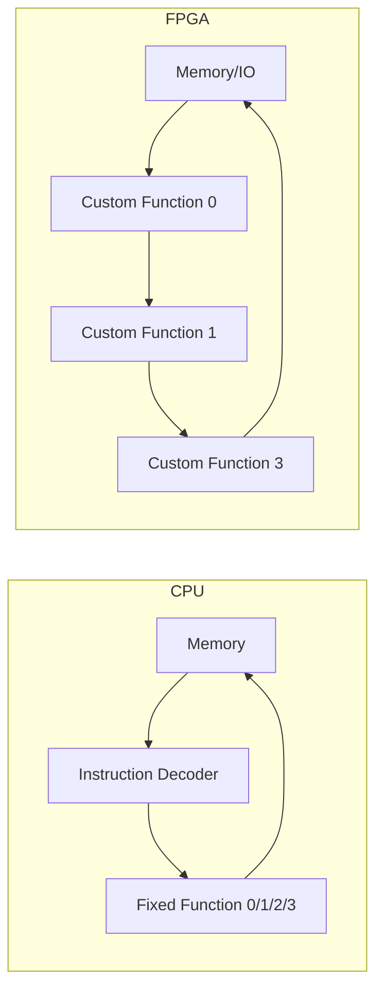

> [!NOTE] Definition
> A Field-Programmable Gate Array (FPGA) is reconfigurable hardware consisting of a grid of Configurable Logic Blocks (CLBs), embedded memory, DSP blocks, and I/O blocks connected by a programmable interconnect, letting a designer implement essentially any digital circuit and reprogram it after manufacturing.

## Structure

| Component | Role |
|---|---|
| **CLB (Configurable Logic Block)** | Implements small logic functions via a lookup table (LUT) driven by configuration memory, plus a flip-flop for state |
| **Embedded Memory** | On-chip block RAM for buffering data close to compute |
| **DSP Block** | Hardened arithmetic units (multiply-accumulate) for common operations |
| **IOB (I/O Block)** | Interfaces to pins at the chip boundary |

A logic block's function is set by loading values into its configuration memory, which drives a multiplexer tree - by changing this configuration, the same physical silicon can implement completely different logic.

## Free Choice of Architecture

Unlike a CPU with a fixed instruction pipeline (Memory → Instruction Decoder & Scheduler → one of several Fixed Functions → back to Memory), an FPGA has a **custom pipeline**: the dataflow is tailored directly to the application, and custom logic can be implemented without composing it from a fixed set of pre-built functions.

This enables **fine-grained pipelining**, direct inter-operator communication, and distributed on-chip memory - at the cost that every implemented operation permanently occupies chip space, unlike a CPU where the same ALU is time-shared across many different operations.

## Programming FPGAs

The core challenge is adapting an algorithm to exploit the FPGA's spatial parallelism rather than a sequential instruction stream.

1. **Coding** - hardware description languages (VHDL, Verilog) or increasingly high-level languages (High-Level Synthesis, HLS)
2. **Synthesis** - produces a logic-gate-level representation, valid for any FPGA
3. **Place & Route** - maps the synthesized circuit onto the specific resources (CLBs, wiring) of a target FPGA

The flow for an [[Application-Specific Integrated Circuit|ASIC]] is similar, except the final circuit is mapped onto dedicated silicon instead of reused, reconfigurable FPGA resources.

## Key Challenge: Low Clock Frequency

FPGAs typically run at 200-300 MHz, compared to 3-5 GHz for a modern CPU - roughly an order of magnitude slower per clock. To achieve competitive performance, an FPGA design **must** exploit parallelism (multiple concurrent compute units, deep pipelining) to compensate for its much lower clock speed.

## Related Concepts

- [[Hardware Specialization Spectrum]]: FPGAs sit between DSPs and ASICs on the efficiency/flexibility curve
- [[Application-Specific Integrated Circuit]]: the non-reconfigurable, higher-efficiency endpoint FPGA logic can eventually be "hardened" into
- [[FPGA-Accelerated Parquet Parsing]]: a concrete database application of FPGA custom pipelines
