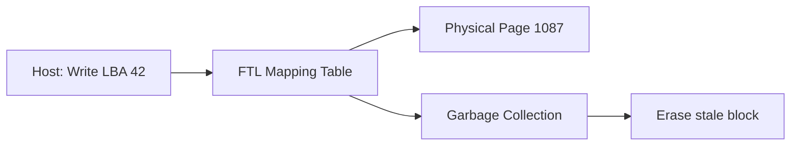

> [!NOTE] Definition
> The Flash Translation Layer (FTL) is firmware inside the SSD controller that translates logical block addresses (LBAs) from the host into physical page addresses on the NAND flash. It hides the erase-before-write constraint of flash memory, making the SSD appear as a regular block device to the operating system.

## Why FTL is Needed

NAND flash has three constraints that differ from traditional disks:
1. **Pages cannot be overwritten** - a page must be erased before it can be written again
2. **Erase operates on blocks** - erasing a block affects all pages in it (128-256 pages)
3. **Flash cells wear out** - each cell supports a limited number of program/erase (P/E) cycles

The FTL abstracts these away using an indirection layer.

## How It Works

1. **Write**: FTL writes to a free physical page and updates the mapping table (LBA 42 now points to page 1087 instead of its old location)
2. **Read**: FTL looks up the mapping table to find the current physical page for the requested LBA
3. **Old page** becomes **invalid** (stale) - it will be reclaimed by garbage collection

## Mapping Granularity

| Approach | Mapping | RAM Cost | Performance |
|---|---|---|---|
| **Page-level** | LBA to page | High (large table) | Best (any page freely remapped) |
| **Block-level** | LBA range to block | Low | Poor (updates cause copying) |
| **Hybrid** | Mix of both | Medium | Good |

> [!IMPORTANT]
> The FTL mapping table must be stored in SSD-internal DRAM for fast access. For a 1 TB SSD with 4 KB pages, page-level mapping needs ~1 GB of DRAM just for the table. This is why SSDs contain significant amounts of RAM.

## Garbage Collection

When free pages run low:
1. Select a block with many invalid pages (victim block)
2. Copy valid pages from the victim to a free block
3. Erase the victim block, making all its pages available

This process causes [[Write Amplification]] since valid data must be rewritten.

## TRIM Command

When the OS deletes a file, the FTL doesn't know those pages are now invalid. The TRIM command explicitly informs the FTL, allowing it to:
- Mark pages as invalid immediately
- Improve garbage collection efficiency
- Reduce [[Write Amplification]]

## Related Concepts

- [[SSD Architecture]]: the hardware that the FTL manages
- [[Write Amplification]]: caused by FTL garbage collection
- [[Wear Leveling]]: FTL distributes writes to extend SSD lifetime
- [[SSD Performance Characteristics]]: FTL behavior directly impacts SSD performance patterns
