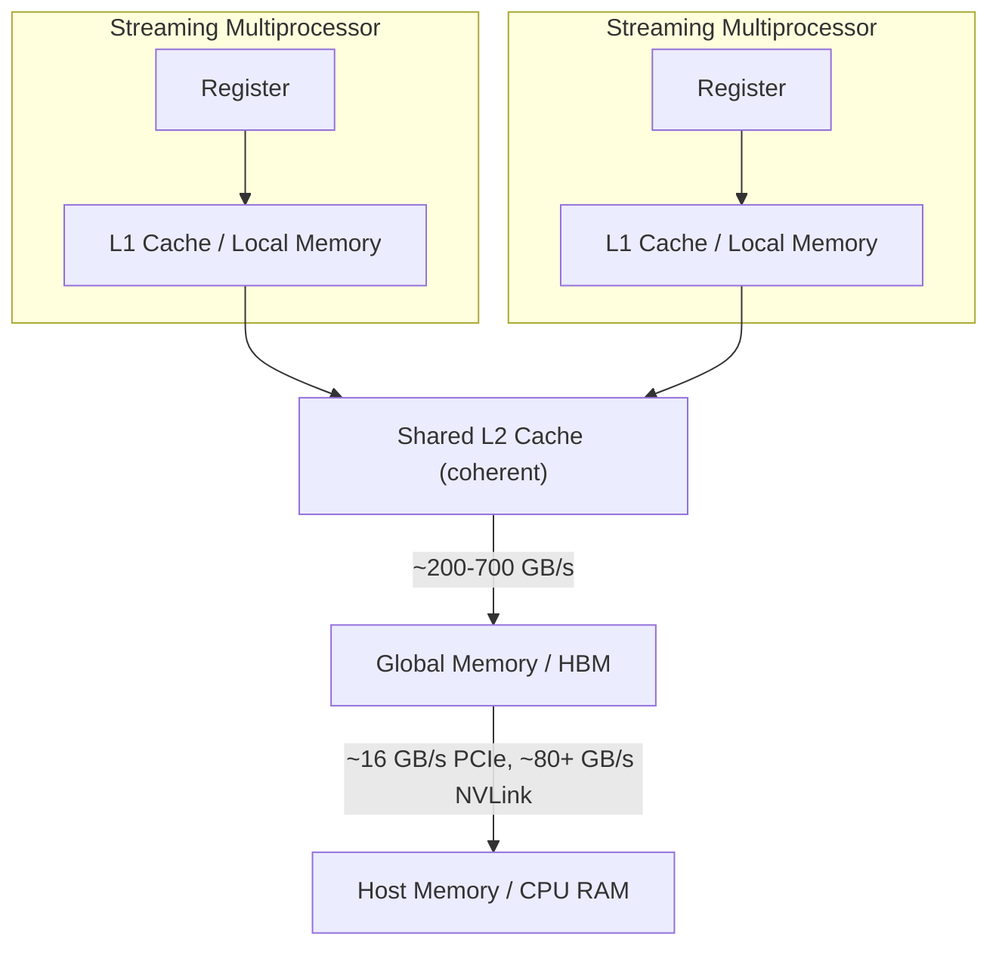

> [!NOTE] Definition
> A GPGPU (General-Purpose GPU) consists of many **Streaming Multiprocessors (SMs)**, each with its own registers, L1 cache, and small private local memory, all sharing a coherent L2 cache backed by high-bandwidth global memory (HBM), which is in turn connected to host (CPU) memory over a comparatively slow bus.

## Memory Hierarchy

| Level | Scope | Notes |
|---|---|---|
| **Register / L1 / Local Memory** | Private per SM | Non-coherent scratchpad, only a few KB |
| **L2 Cache** | Shared across all SMs | Coherent |
| **Global Memory (HBM)** | Whole GPU | Less capacity than CPU RAM, but far higher bandwidth |
| **Host Memory** | CPU | Reached only over a comparatively narrow bus (PCIe or NVLink) |

## GPU Generations (NVIDIA)

| GPU | Architecture | SMs | Cores/SM | Total CUDA Cores | HBM |
|---|---|---|---|---|---|
| V100 | Volta | 80 | 64 | 5120 | 16-32 GB HBM2 |
| A100 (80GB) | Ampere | 108 | 64 | 6912 | 40-80 GB HBM2e |
| H100 | Hopper | 132 | 64 | 8448 | 80 GB HBM3 |
| B100/200 | Blackwell | 160 | 128 | 20480 | 192 GB HBM3e |

Core count and on-package memory capacity have both grown roughly 4-6x since 2016, but the GPU-to-host bus (PCIe) has not scaled nearly as fast, making the CPU-GPU link an increasingly relevant bottleneck.

## Multi-GPU and NVLink

| Link | Bandwidth |
|---|---|
| PCIe 5.0 x16 | ~63 GB/s |
| NVLink 4.0 (per lane, bidirectional) | ~50 GB/s |
| NVIDIA Hopper (18 NVLinks aggregate) | ~1800 GB/s |

**NVLink** is used mainly for GPU-to-GPU communication in multi-GPU servers; PCIe still dominates for CPU-to-GPU transfers on most systems.

## CPU vs. GPU: Scale

| | CPU | GPU |
|---|---|---|
| **Cores** | 10s to 100s | 1000s to 10000s |
| **Memory bandwidth** | ~100 GB/s | Few TB/s |
| **Memory capacity** | 100s-1000s of GB | 10s-100s of GB |

Despite having far more raw compute and bandwidth, a GPU's **execution model** differs fundamentally from a CPU's - see [[CUDA Programming Model]].

## Related Concepts

- [[CUDA Programming Model]]: how work is expressed and scheduled onto this architecture
- [[Hardware Specialization Spectrum]]: GPUs occupy the middle of the flexibility/efficiency curve
- [[NUMA Architecture]]: an analogous locality concern exists between CPU sockets, as it does between host and GPU memory
