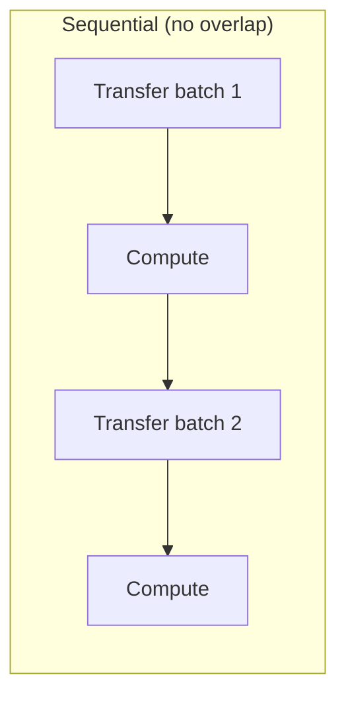

> [!NOTE] Definition
> Because GPU global memory is much smaller than CPU RAM, a DBMS must choose an execution model for how data and intermediate results move between CPU and GPU during query processing.

## Run-to-Finish

Copy the complete input for a query to the GPU, execute all kernels, and copy the output back. This is still limited by GPU global memory size, but helps run multiple queries since not the complete database needs to reside in GPU memory at once - only the working set of the current query.

## Batch Processing

Execute a kernel repeatedly on blocks/batches of data rather than the whole input at once. This raises the question of what to do when **intermediate state** (e.g., a hash table being built) does not fit in GPU memory:

| Alternative | Approach |
|---|---|
| **NVIDIA Unified Memory** | Seamless shared memory abstraction between CPU and GPU, managed transparently by the driver |
| **Manual paging** | The DBMS pages data in/out of GPU memory itself, effectively acting as its own buffer manager on the GPU |

## Example: Batch-Based Hash Join

Building a hash join of tables R and S (stored in CPU RAM) in batches:

1. Copy batches of R to the GPU and build a global hash table incrementally
2. Copy batches of S to the GPU and probe into the hash table, copying results back incrementally

> [!IMPORTANT]
> **The core issue: data transfer dominates.** Typical database operations (selection, hash table build) are not compute-intensive enough to keep the GPU busy while transfer is happening, so naive batch execution alternates between idle GPU (during transfer) and idle transfer bus (during compute).



## Overlapping Transfer and Compute

CUDA supports asynchronous memory copies, but exploiting them requires multiple **CUDA streams** - independent queues of kernels/copies:

- Within one stream, all operations execute **sequentially**
- Across streams, the GPU can overlap a copy in one stream with compute in another

```
Stream 0: copy0 -> build0 -> copy2 -> build2 -> copy4 -> build4
Stream 1:          copy1 -> build1 -> copy3 -> build3 -> copy5 -> build5
```

`copy0` blocks `build0` until it finishes, but `copy1` (a different stream) can run concurrently with `build0`. Using more streams generally improves overlap further, up to the limits of the transfer bus and compute capacity.

## Related Concepts

- [[GPU Architecture]]: the host-to-GPU bandwidth limits that motivate overlapping
- [[CUDA Programming Model]]: kernels are the unit of work scheduled within these streams
- [[Operator and Data Placement]]: a complementary strategy that decides *where* (not just *when*) work happens
- [[GPU-Direct Storage]]: an alternative data path when even CPU RAM cannot hold all the data
