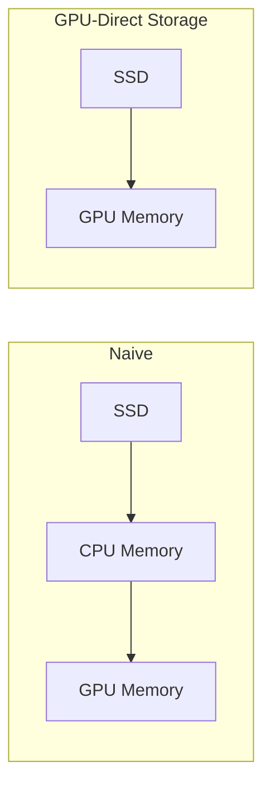

> [!NOTE] Definition
> GPU-Direct Storage (GDS) is a data path that copies data directly from an SSD array to GPU memory over PCIe, skipping the CPU RAM staging step that a naive data path would require.

## Why It's Needed

GPU memory capacity is small relative to modern datasets - even newer GPUs with 100s of GB of HBM are dwarfed by CPU RAM (host memory) capacity, let alone full datasets on disk. Two alternatives exist for storing data that doesn't fit in GPU memory:

| Alternative | Idea | Limitation |
|---|---|---|
| **CPU RAM (host memory)** | Store all data in CPU RAM, copy to GPU as needed | PCIe bus (~60 GB/s) is far slower than either CPU RAM bandwidth or GPU HBM bandwidth (~4.8 TB/s) |
| **SSDs** | Store all data on an SSD array, copy to GPU as needed | Similar bandwidth constraint, but with a different data path |

SSDs have become an increasingly attractive storage tier for DBMSs: performance-per-dollar for flash has been improving faster than DRAM, giving good capacity and cost characteristics while retaining reasonable throughput.

## Naive vs. Direct Data Path

**Naive path** (SSD -> CPU -> GPU):
1. Copy batch from SSD to CPU memory
2. Copy batch from CPU memory to GPU memory
3. Start kernel on the batch

**GPU-Direct Storage path** (SSD -> GPU):
1. Copy directly from SSD to GPU memory
2. Start kernel on the batch

> [!IMPORTANT]
> GDS eliminates one hop of data movement, but the CPU still has to **initiate** the I/O (execute a kernel/driver call to move the data) - it is removed from the data path, not from the control path.

## Optimizations on Top of GDS

- **Overlap transfer and compute**: identical idea to overlapping CPU-to-GPU transfers with CUDA streams (see [[GPU Query Execution Models]])
- **Heavy-weight compression on SSD**: since the GPU has abundant compute, data can be stored heavily compressed on the SSD and decompressed on the GPU, effectively trading cheap GPU compute for scarce SSD bandwidth - decompression should itself be overlapped with I/O
- **Pruning with fine-grained metadata**: keeping richer per-batch metadata (not just min/max) lets more irrelevant data be skipped before it is even read from the SSD

## Related Concepts

- [[GOLAP]]: a concrete research system built on GPU-Direct Storage plus compression and pruning
- [[GPU Query Execution Models]]: the overlap-transfer-and-compute technique GDS reuses
- [[SSD Architecture]]: the underlying storage device GDS reads from
