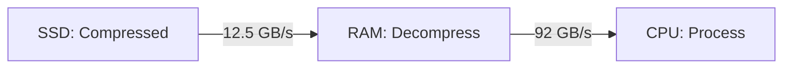

> [!NOTE] Definition
> Heavyweight compression uses general-purpose algorithms (LZ4, Snappy, Zstandard, DEFLATE) that exploit complex data patterns across columns. Unlike [[Lightweight Compression]], data must be fully decompressed before any query operations can be performed on it.

## Lightweight vs Heavyweight

| Property | Lightweight | Heavyweight |
|---|---|---|
| Compression ratio | Lower | Higher |
| Speed | Very fast | Slower |
| Query on compressed? | Yes | No - must decompress first |
| Scope | Single column | Can exploit cross-column patterns |
| Examples | [[Dictionary Encoding]], [[Bit-Packing Encoding]], [[Run-Length Encoding]] | LZ4, Snappy, Zstandard, DEFLATE |

## The Case for Heavyweight Compression

Lightweight schemes reduce memory per individual column but cannot exploit complex dependency patterns between columns. Heavyweight approaches can achieve much higher compression ratios.

However, the decompression overhead makes them impractical for pure in-memory DBMS where memory bandwidth is abundant (~80 GB/s).

## The SSD Opportunity

When data lives on SSDs (bandwidth ~12-16 GB/s), compression becomes critical:

> [!IMPORTANT]
> With CPU-only decompression, heavyweight compression on SSDs provides minimal benefit - the decompression overhead on CPU dominates runtime, shifting the bottleneck from I/O to compute. The solution is offloading decompression to GPU.

## GPU-Accelerated Decompression

The GPU-in-Data-Path architecture (Golap) uses massive GPU parallelism to decompress data as it streams from SSD:

1. **Opportunistic Pruning** - skip irrelevant chunks on SSD
2. **GPU Direct I/O** - transfer compressed data directly to GPU memory
3. **On-the-fly Decompression** - GPU decompresses (LZ4, DEFLATE) in parallel
4. **GPU-CPU Query Co-Execution** - query operators run on decompressed data

This achieves effective bandwidth exceeding in-memory DBMS performance, even with data on SSD.

## Advanced: Semantic Compression

Research direction (DeepSqueeze, SIGMOD 2020): use deep learning to learn cross-column patterns and compress tabular data semantically. The ML model itself becomes the compressed representation.

## Related Concepts

- [[Lightweight Compression]]: designed for direct query processing without decompression
- [[Query Processing on Compressed Data]]: only works with lightweight schemes
- [[SSD Architecture]]: the bandwidth bottleneck that motivates compression
- [[Column Store]]: the storage model both compression types target
