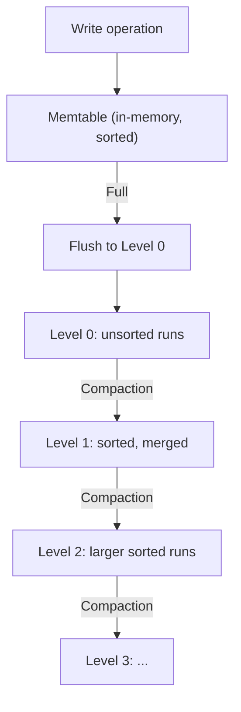

> [!NOTE] Definition
> A Log-Structured Merge Tree (LSM Tree) is a data structure optimized for write-heavy workloads. It buffers all writes in an in-memory component (memtable), then flushes them as sorted runs to persistent storage. Background compaction merges sorted runs to maintain read performance. LSM trees convert random writes into sequential writes, making them ideal for [[SSD Architecture|SSDs]].

## How It Works

1. **Write**: insert into memtable (a sorted in-memory structure like a red-black tree or skip list)
2. **Flush**: when memtable is full, write it as a sorted run (SSTable) to Level 0
3. **Compaction**: background process merges overlapping sorted runs at each level into larger sorted runs at the next level
4. **Read**: check memtable first, then search each level (using bloom filters to skip levels)

## Write Optimization

| B-Tree | LSM Tree |
|---|---|
| Random writes to leaf pages | Sequential writes (flush + compaction) |
| Read-modify-write per update | Append-only writes |
| [[Write Amplification]]: ~10-30x on SSD | Write amplification: ~10x (compaction) |
| Good read performance | Read requires checking multiple levels |

> [!IMPORTANT]
> LSM trees trade read performance for write performance. A point lookup may need to check multiple levels. Bloom filters and fence pointers mitigate this by quickly eliminating levels that don't contain the key.

## Compaction Strategies

| Strategy | Description |
|---|---|
| **Size-tiered** | Merge runs of similar size; simpler, more space amplification |
| **Leveled** | Each level has one sorted run; better read performance, more write amplification |

## Why LSM Trees Suit SSDs

- **Sequential writes** reduce [[Write Amplification]] at the SSD level
- **Large batch writes** exploit SSD internal parallelism
- **Immutable sorted runs** are SSD-friendly (no in-place updates)
- **Compaction** can be scheduled during idle periods

## Related Concepts

- [[SSD-Aware Database Design]]: LSM trees are a primary SSD-optimized structure
- [[Write Amplification]]: LSM trees reduce SSD-level write amplification but have their own compaction amplification
- [[SSD Performance Characteristics]]: LSM tree design exploits sequential write advantage
