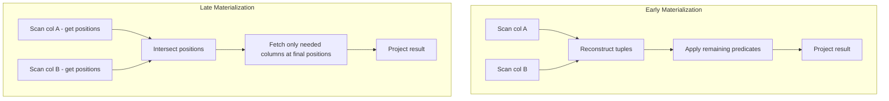

> [!NOTE] Definition
> Late materialization is a query execution strategy in [[Column Store]] systems that delays the reconstruction of full tuples as long as possible. Instead of immediately combining columns into rows, it passes **position lists** (arrays of qualifying row positions) between operators.

## Early vs Late Materialization

| Strategy | Tuple Construction | Data Moved |
|---|---|---|
| **Early** | Before filtering | All columns for all candidates |
| **Late** | After all filtering | Only result columns for final matches |

## Benefits

1. **Reduced memory bandwidth** - only qualifying columns are read at the end
2. **Better compression** - columns stay compressed longer, enabling [[Query Processing on Compressed Data]]
3. **SIMD-friendly** - position lists and column arrays enable [[SIMD Processing]]
4. **Cache efficiency** - less data moved through [[Memory Hierarchy]]

> [!IMPORTANT]
> Late materialization is one of the key reasons [[Column Store]] systems outperform [[Row Store]] systems for analytical queries. By avoiding premature tuple reconstruction, they minimize the amount of data that flows through the query pipeline.

## Position Lists

A position list is a sorted array of row indices where a predicate is satisfied:

$$P = \{i \mid \text{predicate}(A[i]) = \text{true}\}$$

Multiple predicates produce multiple position lists that are intersected (AND) or unioned (OR) using fast merge operations or [[Bit-Packing Encoding|bit-vector]] operations.

## Related Concepts

- [[Column Store]]: the storage model that enables late materialization
- [[Query Processing on Compressed Data]]: late materialization keeps data compressed longer
- [[Predicate Evaluation]]: determines the position lists
- [[SIMD Processing]]: accelerates both predicate evaluation and position list operations
