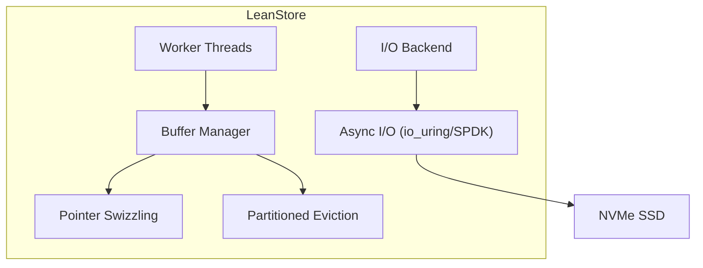

> [!NOTE] Definition
> LeanStore is a storage engine architecture designed to fully exploit NVMe SSD performance. With NVMe random read latency around 10 us (~13,000 CPU cycles), the software stack must be extremely lean to avoid becoming the bottleneck. LeanStore achieves this through optimized buffer management, user-space threading, and [[Pointer Swizzling]].

## Motivation

Modern NVMe SSDs provide:
- ~10 us random read latency
- ~13,000 CPU cycles per I/O operation at 1.3 GHz
- Multiple GB/s throughput

Traditional DBMS buffer managers waste too many of these cycles on:
- Hash table lookups in the page table
- Latch acquisition on buffer frames
- Kernel context switches for I/O

## Architecture

## Key Optimizations

| Optimization | What it does | Cycles saved |
|---|---|---|
| [[Pointer Swizzling]] | Replace page IDs with memory pointers | Eliminates page table lookups |
| Partitioned eviction | Divide buffer into partitions, evict per-partition | Reduces contention |
| User-space threading | Lightweight context switches | Avoids kernel overhead |
| 4 KB pages | Match SSD page size | Optimal I/O alignment |
| DB-managed RAID | Software RAID at DBMS level | Better I/O scheduling |

## I/O Budget

With ~13,000 cycles per I/O, the budget must be carefully allocated:

> [!IMPORTANT]
> Every unnecessary operation (hash table lookup, cache miss, context switch) consumes cycles from the tight I/O budget. LeanStore's design principle: remove every layer of indirection that traditional DBMS architectures accumulated when disk I/O was the dominant cost.

## 4 KB Page Size

Traditional DBMS use 8-16 KB pages (optimized for HDD seek time). For NVMe:
- **4 KB pages** are optimal because they match the SSD's internal page size
- Smaller pages reduce read amplification for random lookups
- NVMe handles small random reads efficiently (no seek time)

## Related Concepts

- [[Pointer Swizzling]]: key technique used by LeanStore to avoid page table lookups
- [[Database I/O Interfaces]]: the I/O APIs LeanStore uses (io_uring, SPDK)
- [[SSD Architecture]]: the NVMe hardware LeanStore is designed for
- [[B+ Tree Latch Coupling]]: concurrency protocol used with LeanStore's B+ trees
