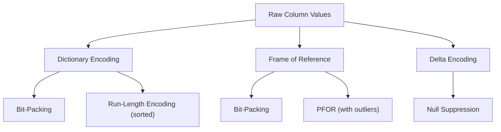

> [!NOTE] Definition
> Lightweight compression refers to a family of simple, fast compression techniques designed for [[Column Store]] systems. Unlike heavyweight compression (LZ4, Snappy, gzip), lightweight schemes allow direct [[Query Processing on Compressed Data]] without decompression, trading compression ratio for processing speed.

## Lightweight vs Heavyweight Compression

| Property | Lightweight | Heavyweight |
|---|---|---|
| Compression ratio | Moderate (2-10x) | High (5-100x) |
| Decompression speed | Very fast / not needed | Moderate |
| Query on compressed data | Yes | No (must decompress first) |
| Examples | Dictionary, RLE, FOR, Bit-packing | LZ4, Snappy, gzip, zstd |
| Use case | In-memory OLAP | Archival, disk storage |

## Core Techniques

| Technique | Best For | Note Link |
|---|---|---|
| [[Dictionary Encoding]] | String columns, low cardinality | Foundation of column compression |
| [[Run-Length Encoding]] | Sorted columns, repeated values | Requires sorted data |
| [[Bit-Packing Encoding]] | Integer codes with small range | Often combined with dictionary |
| [[Frame of Reference Encoding]] | Clustered numeric values | Per-block reference value |
| [[Delta Encoding]] | Sorted/sequential numeric data | Stores differences |
| [[Null Suppression]] | Values with leading zeros | Removes empty bytes |
| [[PFOR Encoding]] | FOR with outliers | Patches exceptions separately |

> [!IMPORTANT]
> The key advantage of lightweight compression is not just space savings - it actually **improves query performance** by reducing memory bandwidth requirements. Fewer bytes transferred through the [[Memory Hierarchy]] means fewer cache misses, and [[SIMD Processing]] can process more logical values per register.

## Cascading Compression

Techniques are often combined in sequence:
1. [[Dictionary Encoding]] - strings to integers
2. [[Frame of Reference Encoding]] or [[Delta Encoding]] - reduce integer range
3. [[Bit-Packing Encoding]] - store in minimum bits

Each stage reduces the data further while maintaining the ability to process queries directly.

## Related Concepts

- [[Column Store]]: the storage model lightweight compression is designed for
- [[Query Processing on Compressed Data]]: the ability to query without decompression
- [[SIMD Processing]]: compressed data fits more values per SIMD register
- [[Memory Hierarchy]]: compression reduces data movement through the hierarchy
