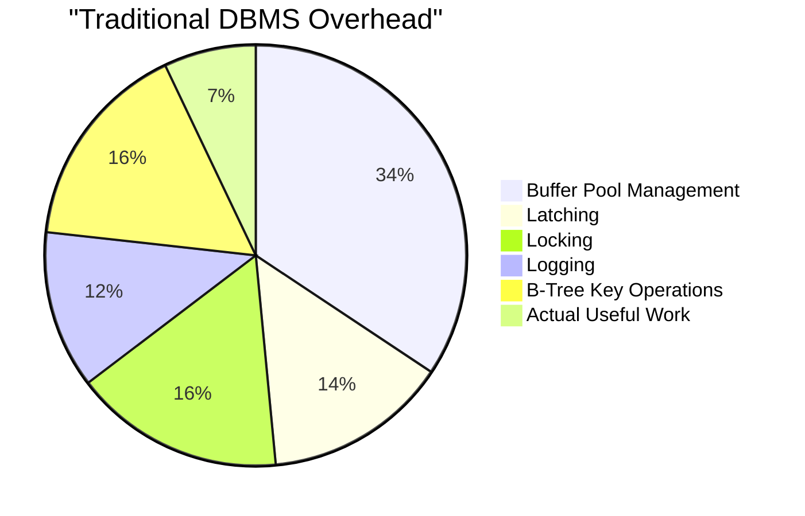

> [!NOTE] Definition
> A main memory DBMS assumes that the entire database (or its working set) fits in DRAM. This eliminates the disk I/O bottleneck that dominates traditional [[Disk-Based DBMS]] systems, but shifts the performance bottleneck to the [[Memory Hierarchy]] - specifically cache misses and CPU efficiency.

## Why Main Memory?

DRAM prices have dropped to the point where databases of hundreds of GB fit in a single server's RAM. At the same time, the bottleneck analysis of traditional systems shows that most overhead comes from disk-oriented mechanisms:

> [!IMPORTANT]
> In a disk-based system, only about 7% of CPU cycles go to actual query processing. The rest is spent managing the buffer pool, locks, latches, and logging. Main memory systems eliminate or simplify most of this overhead.

## Design Changes

| Disk-Based Approach | Main Memory Approach |
|---|---|
| Buffer pool for page caching | Direct memory pointers |
| Heavy-weight locking | Lightweight latches or lock-free |
| Write-ahead logging to disk | Optimistic logging, group commit |
| B-tree indexes (disk-friendly) | T-trees, ART, hash indexes (cache-friendly) |
| [[Row Store]] (NSM) pages | [[Column Store]] (DSM) arrays |

## New Bottleneck: Cache Efficiency

With disk I/O eliminated, performance depends on:
- **Cache miss rate** - how often data must be fetched from DRAM
- **Branch misprediction** - cost of unpredictable control flow
- **SIMD utilization** - how well [[SIMD Processing]] can be exploited

The choice of storage layout ([[Row Store]] vs [[Column Store]] vs [[PAX]]) directly impacts cache behavior.

## Related Concepts

- [[Disk-Based DBMS]]: the traditional architecture that main memory systems replace
- [[Memory Hierarchy]]: cache behavior becomes the primary performance concern
- [[Column Store]]: the preferred storage model for analytical main memory systems
- [[Row Store]]: the traditional storage model, less cache-efficient for scans
- [[SIMD Processing]]: key to exploiting CPU capabilities in main memory systems
