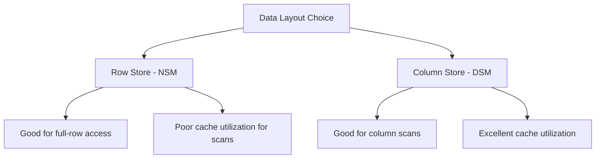

> [!NOTE] Definition
> The memory hierarchy organizes computer storage in layers ordered by speed and capacity. Faster layers (registers, caches) are small and expensive, while slower layers (DRAM, disk) are large and cheap. Database performance depends heavily on how well data access patterns exploit this hierarchy.

## Levels

## Cache Lines and Spatial Locality

Data moves between levels in fixed-size blocks called **cache lines** (typically 64 bytes). When the CPU accesses a memory address, the entire cache line containing that address is loaded.

This means:
- **Sequential access** is fast - subsequent elements are already in cache
- **Random access** is slow - each access may trigger a cache miss
- Data structures should be **cache-friendly** (contiguous, compact)

## Relevance for Databases

[[Main Memory DBMS]] systems must be designed with cache behavior in mind. The choice between [[Row Store]] and [[Column Store]] storage models directly impacts how well the system exploits the memory hierarchy.

## Related Concepts

- [[Main Memory DBMS]]: assumes data fits in DRAM, making cache behavior the primary bottleneck
- [[Disk-Based DBMS]]: traditional systems designed around the DRAM-to-disk boundary
- [[Row Store]]: N-ary Storage Model optimized for full-row access
- [[Column Store]]: Decomposition Storage Model optimized for columnar scans
