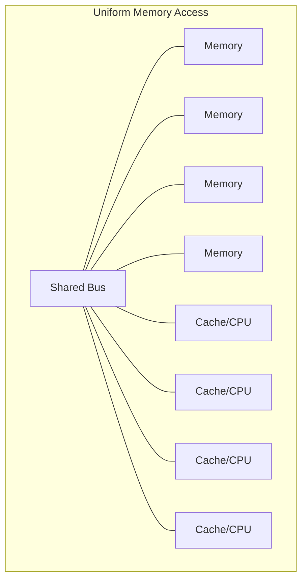
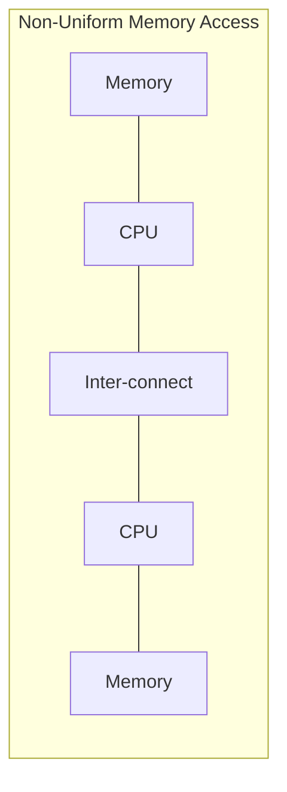

> [!NOTE] Definition
> Non-Uniform Memory Access (NUMA) is a memory architecture where each CPU socket has its own locally attached memory, and accessing a "remote" memory region attached to a different socket is slower than accessing "local" memory.

## Uniform vs. Non-Uniform Memory Access

| | UMA | NUMA |
|---|---|---|
| **Memory access latency** | Same from every CPU | Depends on distance to the memory's home socket |
| **Scalability** | Bus becomes a bottleneck at high core counts | Scales better across many sockets |
| **Software impact** | No locality concerns | Requires NUMA-aware scheduling and data placement |

Modern servers are typically NUMA - and increasingly, non-uniformity applies not just across sockets but even within a socket at the L3 cache level.

## Measuring NUMA Effects

Tools like `numactl --hardware` report the NUMA node topology (which cores belong to which node), and `mlc` (Intel Memory Latency Checker) can measure idle latency and bandwidth between nodes - remote access latency (e.g., ~150ns) is typically 1.5-2x higher than local access (e.g., ~90ns), and remote bandwidth can be 2-3x lower.

> [!IMPORTANT]
> Regardless of the scheduling or worker allocation policy a DBMS uses, workers should operate on NUMA-local data. Ignoring NUMA topology can severely limit scalability, since all workers may contend for the same remote memory bus.

## Related Concepts

- [[DBMS Task Scheduling]]: the scheduler must be aware of NUMA topology to place tasks correctly
- [[Data Partitioning and Placement]]: the technique used to keep each worker's data NUMA-local
- [[Memory Hierarchy]]: NUMA adds another layer of locality beyond CPU caches
