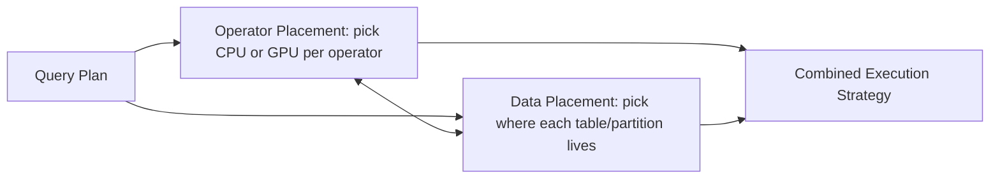

> [!NOTE] Definition
> In a heterogeneous DBMS with both CPU and GPU (or other accelerators), the query optimizer must decide both **operator placement** (which processor executes each operator) and **data placement** (which processor's memory holds which part of the database).

## Operator Placement

Select a processor (CPU or GPU) for each operator in the query plan, typically trying to **minimize data shipment cost** - an operator should run where its input data already resides, unless the compute speedup from moving it outweighs the transfer cost.

## Data Placement

Select which part of the database is stored in a co-processor's (GPU's) memory, aiming to **increase data locality across queries** - if the same table is repeatedly scanned by GPU-executed operators, keeping it resident in GPU memory avoids repeated transfers.

## Combining Both Strategies

Query execution can combine both: a good data placement reduces the transfer cost that operator placement has to account for, and a good operator placement exploits whatever data is already resident where it runs. This is directly analogous to [[Data Partitioning and Placement|NUMA-aware partitioning]] on multi-socket CPUs, but with the CPU-GPU link as an even more constrained resource than inter-socket interconnects.

## Related Concepts

- [[GPU Query Execution Models]]: the run-to-finish/batch strategies this placement decision interacts with
- [[Data Partitioning and Placement]]: the analogous NUMA-local placement problem on CPU-only systems
- [[DBMS Task Scheduling]]: operator placement is a heterogeneous generalization of task-to-worker scheduling
