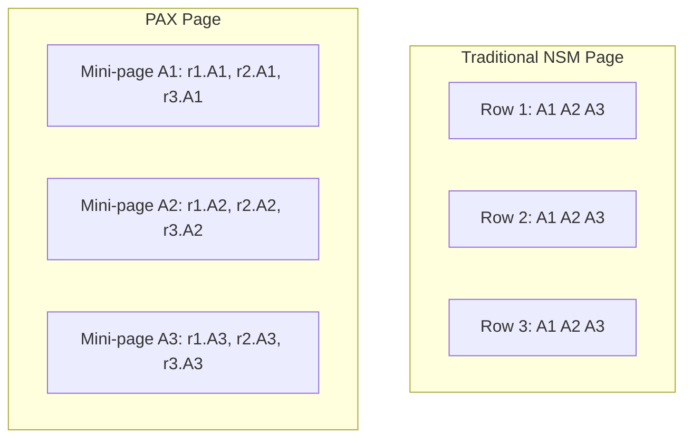

> [!NOTE] Definition
> PAX (Partition Attributes Across) is a hybrid storage model that divides each database page into mini-pages, one per attribute. Within a page, data is stored column-wise, but across pages, data is organized by rows. This combines the cache efficiency of [[Column Store]] with the page-level locality of [[Row Store]].

## Layout

Each page contains the same set of tuples, but attributes are stored together in mini-pages rather than interleaved.

## Comparison

| Property | [[Row Store\|NSM]] | [[Column Store\|DSM]] | PAX |
|---|---|---|---|
| Cache behavior (scan) | Poor | Excellent | Good |
| Tuple reconstruction | Free | Expensive | Cheap (within page) |
| Compression potential | Low | High | Medium |
| Page I/O granularity | Row-aligned | Column-aligned | Row-aligned |

> [!IMPORTANT]
> PAX is a compromise: it improves cache utilization for scans compared to NSM without requiring the expensive cross-column tuple reconstruction of full DSM. However, it does not achieve the same compression ratios as a pure column store.

## Related Concepts

- [[Row Store]]: traditional NSM layout that PAX improves upon
- [[Column Store]]: pure columnar layout that PAX partially emulates
- [[Memory Hierarchy]]: PAX is designed to improve cache line utilization
