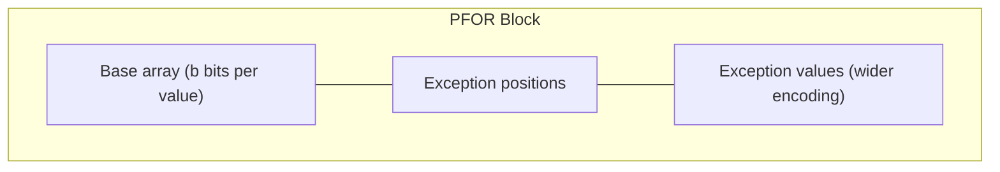

> [!NOTE] Definition
> Patched Frame of Reference (PFOR) extends [[Frame of Reference Encoding]] by handling outliers separately. Instead of increasing the bit-width for the entire block to accommodate a few large values, PFOR stores outliers in a separate exceptions list and uses a narrow bit-width for the majority of values.

## The Outlier Problem

In standard FOR, if a block of 128 values has range $[100, 110]$ except for one outlier at $10000$, all values must use $\lceil \log_2(9901) \rceil = 14$ bits instead of the 4 bits that would suffice for the other 127 values.

## How PFOR Works

1. Choose a bit-width $b$ that covers most values (e.g., the 90th percentile range)
2. Encode values that fit in $b$ bits normally
3. Store exceptions (outliers) in a separate overflow area
4. Use a **patching** mechanism to link exception positions

> [!IMPORTANT]
> PFOR achieves near-optimal compression for the common case while gracefully handling outliers. The key tradeoff is choosing $b$: too small means too many exceptions, too large means wasted bits on the majority.

## Comparison

| Technique | Outlier Handling | Decompression Speed |
|---|---|---|
| [[Frame of Reference Encoding\|FOR]] | Bit-width inflated for all | Very fast (uniform) |
| PFOR | Outliers stored separately | Fast (minor branching) |

## Related Concepts

- [[Frame of Reference Encoding]]: the base technique that PFOR extends
- [[Bit-Packing Encoding]]: used for the base array in PFOR
- [[Lightweight Compression]]: PFOR is an advanced lightweight compression technique
- [[SIMD Processing]]: PFOR's uniform base array enables SIMD decompression
