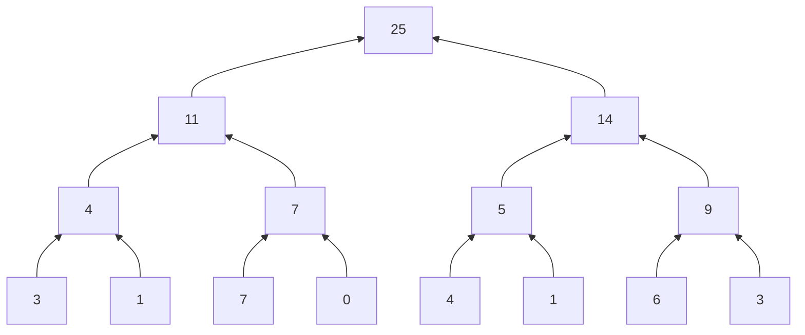
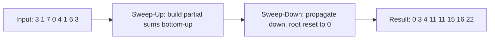

> [!NOTE] Definition
> A **reduction** combines a list of values into a single value using a binary operator (e.g., `reduce(+, [3,1,7,0]) = 11`). A **prefix sum** (scan) computes, for every position $i$, the reduction of all elements before it: $R_{out}[i] = R_{in}[0] + \dots + R_{in}[i-1]$, with $R_{out}[0] = 0$.

Both are fundamental building blocks for parallel programs - reductions implement aggregations (SUM, AVG, MIN, MAX), and prefix sums implement compaction operations like [[GPU Architecture|GPU]]-parallel [[Partition-Based Hash Join|selection/filter]].

## Reduction via a Binary Tree

A reduction of $n$ elements can be computed in $\log_2 n$ steps using a binary reduction tree: each step pairs up adjacent partial results and combines them.



## Reduction on a GPU

1. Create one thread per two input elements
2. At each step, active threads combine a pair of elements and write the result; the step size doubles and the number of active threads halves each iteration
3. After $\log_2 n$ steps, one thread holds the final result

```c
while (number_of_threads > 0) {
    if (tid < number_of_threads) {
        const auto fst = tid * step_size * 2 + step_size - 1;
        const auto snd = fst + step_size;
        input[snd] += input[fst];
    }
    step_size <<= 1;
    number_of_threads >>= 1;
}
```

## Prefix Sum: More Than a Reduction

A prefix sum needs the *partial* sums at every position, not just the final total, so it is computed in **two phases**:

### Sweep-Up Phase
Identical to the reduction tree above - compute partial sums bottom-up, but keep every intermediate value instead of discarding them.

### Sweep-Down Phase
Starting from the root (set to 0, replacing the final total), propagate values back down the tree: at each step, the left child receives the parent's value (move-down), and the right child receives the parent's value plus the left child's original value (partial sum).



## Synchronization Concerns

Both sweep-up and sweep-down require **synchronization per tree level**, since each level depends on results from the previous one:

- Within a block: `__syncthreads()` after each level
- Across blocks: no such guarantee exists, so a multi-block reduction/scan needs an additional coordination step (e.g., a separate kernel launch) - see [[CUDA Programming Model]]
- Copying results after the prefix sum is typically done in a **separate kernel** to guarantee ordering

## Application: Parallel Selection (Filter)

To parallelize `SELECT * FROM R WHERE p` on a GPU:

1. **Build a flag array**: `flags[i] = 1` if `pred(val[i])`, else `0`
2. **Compute a prefix sum** `ps` over `flags` - this gives each qualifying tuple its final, compacted output position
3. **Scan and write**: each thread with `flags[i] = 1` writes `val[i]` to `res[ps[i]]`

This lets every qualifying tuple compute its exact output location independently and in parallel, without any sequential append or locking.

## Related Concepts

- [[CUDA Programming Model]]: the grid/block/warp model these algorithms are implemented within
- [[GPU Architecture]]: the hardware these tree-structured algorithms are designed around
- [[Partition-Based Hash Join]]: another example of restructuring a database operator for parallel hardware
