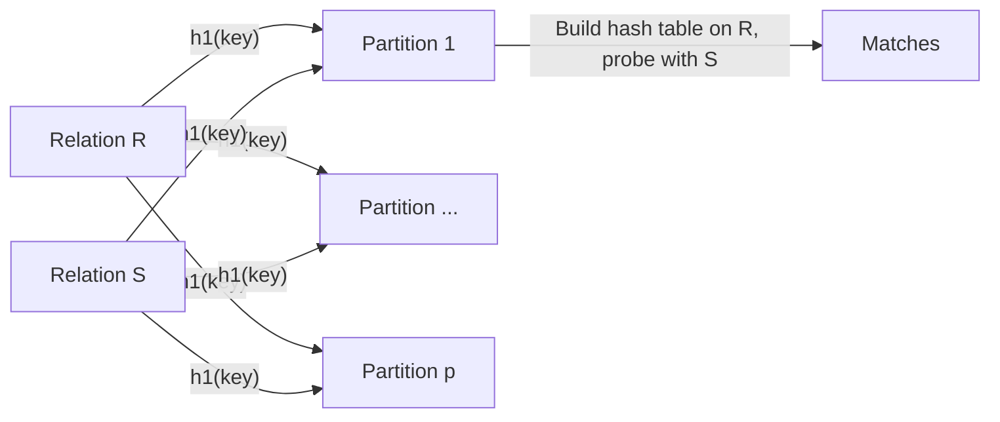

> [!NOTE] Definition
> A partition-based hash join partitions the input relations R and S into disjoint, cache-sized chunks using a hash function on the join key, then joins each pair of corresponding partitions independently using a local hash table - enabling both parallelism and cache efficiency.

Joins dominate analytical query cost - hash join alone accounts for roughly half of total CPU time in the TPC-H benchmark, making its parallelization critical for [[Query Parallelism|OLAP performance]].

## Three Phases

### Phase 1: Parallel Partitioning
Divide the tuples of R and S into partitions using a hash function on the join key. Each thread takes a chunk from its NUMA-local input (a "morsel").

### Phase 2: Parallel Build
Scan each partition of R and build a hash table on the join key, one hash table per partition.

### Phase 3: Parallel Probe
For each tuple in S, look up its join key in the hash table of the corresponding partition of R. If a match is found, output the combined tuple.

## Shared vs. Private Partitions (Partitioning Phase)

| Approach | Description | Trade-off |
|---|---|---|
| **Shared Partitions** | A single global set of partitions that all threads write into | Requires a latch to synchronize concurrent writers |
| **Private Partitions** | Each thread builds its own local set of partitions | No synchronization during partitioning, but partitions must be merged/combined after all threads finish |

## Partitioning Algorithm

1. Take the next input tuple, e.g., `<cid=256, name='Binnig'>`
2. Compute the partition using a hash function on the key, e.g., `cid % number_of_partitions`
3. Append the tuple to that partition in memory
4. Repeat until no tuples remain

A key open question is choosing a good `number_of_partitions`: too few partitions produce hash tables too large to fit in cache; too many partitions increase per-tuple append overhead and TLB pressure. See [[Radix Partitioning]] for a solution to this trade-off.

## Related Concepts

- [[Radix Partitioning]]: a multi-pass refinement that keeps the number of partitions per pass small and TLB-friendly
- [[Parallel Hash Table Construction]]: the build/probe mechanics used per partition
- [[Data Partitioning and Placement]]: the general partitioning concepts this join specializes
- [[Parallel Sort-Merge Join]]: the main alternative parallel join strategy
