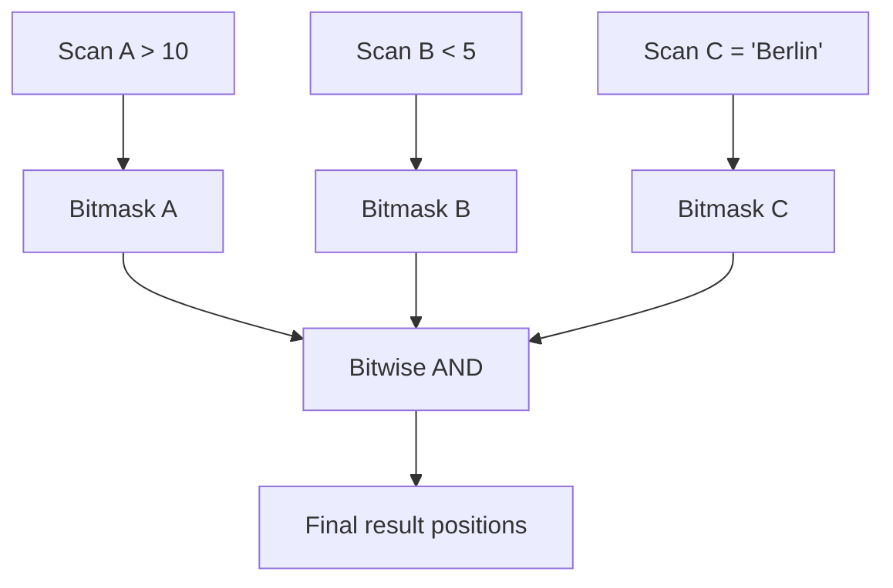

> [!NOTE] Definition
> Predicate evaluation is the process of checking selection conditions (WHERE clauses) against column data during a scan. In [[Column Store]] systems, each predicate produces a bitmask or position list, and multiple predicates are combined using fast bitwise operations.

## Single Predicate Evaluation

For `WHERE A > 10`:
1. Scan column A using [[Vectorized Scan]]
2. Produce a result bitmask: bit $i = 1$ if $A[i] > 10$

## Multi-Predicate Evaluation

For `WHERE A > 10 AND B < 5 AND C = 'Berlin'`:

Bitwise AND/OR operations on bitmasks are extremely fast - a single instruction combines 64 predicate results (or 256/512 with SIMD).

## Evaluation Order Optimization

The order of predicate evaluation matters:
- Evaluate the **most selective** predicate first (produces the smallest bitmask)
- Short-circuit: if the intermediate bitmask becomes all zeros, skip remaining predicates
- Cheaper predicates (integer comparisons) should run before expensive ones (string operations)

## Between Predicates

A `BETWEEN` predicate `WHERE A BETWEEN low AND high` can be optimized:

Instead of two comparisons ($A \geq low$ AND $A \leq high$), transform to a single unsigned comparison:

$$(A - low) \leq (high - low)$$

This works because if $A < low$, the unsigned subtraction wraps around to a large number exceeding $(high - low)$.

> [!IMPORTANT]
> The between-predicate optimization reduces two SIMD comparisons to one subtraction and one comparison, nearly doubling throughput for range queries.

## Related Concepts

- [[Vectorized Scan]]: the scan engine that evaluates individual predicates
- [[SIMD Processing]]: enables parallel predicate evaluation
- [[Bit-Packing Encoding]]: bit-vectors used for multi-predicate combination
- [[Column Imprints]]: can skip entire blocks before predicate evaluation
- [[Zone Maps]]: metadata that eliminates blocks from predicate evaluation
- [[Late Materialization]]: predicate evaluation produces position lists, not tuples
