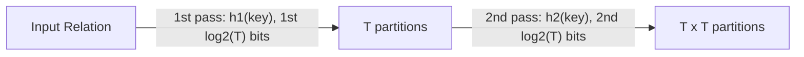

> [!NOTE] Definition
> Radix partitioning splits an input relation into its final number of partitions $p$ over multiple passes, where each pass uses a small fan-out bounded by the number of [[Translation Lookaside Buffer|TLB]] entries, rather than partitioning directly to $p$ in a single pass.

## The Problem with Single-Pass Partitioning

A single-pass [[Partition-Based Hash Join|partition-based hash join]] partitions directly to the desired fan-out $p$ in one pass over the input. But when $p$ is large, each of the $p$ output partitions requires its own actively-written memory page - exceeding the number of TLB entries (typically T = 64-128), causing constant TLB misses on every append.

## Multi-Pass Radix Partitioning

Instead, radix partitioning uses **multiple passes**, each with a small fan-out $T$ bounded by the TLB size, so that all destination pages of a single pass fit in the TLB:

$$i = \log_T p$$

where $i$ is the number of passes needed to reach $p$ total partitions.

Each pass uses a different slice of bits from the hash of the key (e.g., the first $\log_2 T$ bits in pass 1, the next $\log_2 T$ bits in pass 2) to route tuples into $T$ sub-partitions.

## Why This Is Better

Although radix partitioning requires reading and writing the data multiple times (once per pass), the elimination of TLB misses per pass more than compensates for the extra I/O passes - overall throughput is higher than a single, large-fan-out pass.

> [!IMPORTANT]
> The core trade-off: single-pass partitioning minimizes data movement but causes TLB thrashing at high fan-out; radix (multi-pass) partitioning increases data movement but keeps every pass TLB-resident.

## Related Concepts

- [[Partition-Based Hash Join]]: the join algorithm radix partitioning is designed to accelerate
- [[Translation Lookaside Buffer]]: the hardware resource this technique is explicitly designed around
- [[Memory Hierarchy]]: radix partitioning targets cache-sized, TLB-resident working sets
