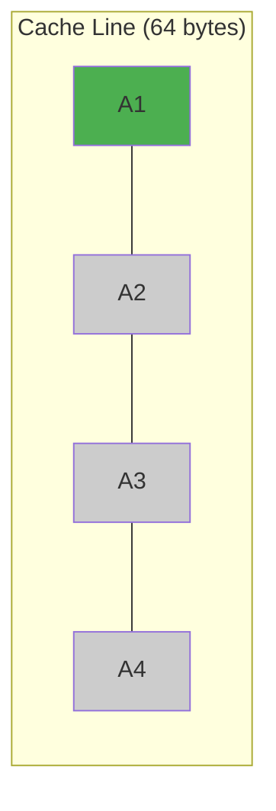

> [!NOTE] Definition
> A row store (N-ary Storage Model, NSM) stores all attributes of a single tuple contiguously in memory. Each row is stored as one unit, similar to how traditional disk-based databases organize data on pages.

## Layout

In NSM, a table with columns $(A_1, A_2, \ldots, A_n)$ and $m$ rows stores data as:

$$[r_1.A_1, r_1.A_2, \ldots, r_1.A_n, r_2.A_1, r_2.A_2, \ldots]$$

Each tuple's attributes sit next to each other in memory.

## Strengths and Weaknesses

| Aspect | Row Store |
|---|---|
| Full-row access | Excellent - one cache line fetch gets the whole tuple |
| Insert/Update | Fast - modify one contiguous region |
| Column scan | Poor - must skip over irrelevant attributes |
| Cache utilization (OLAP) | Low - cache lines contain unused columns |
| Compression | Limited - mixed data types per cache line |

> [!IMPORTANT]
> For analytical queries that touch only a few columns of many rows, NSM wastes memory bandwidth by loading irrelevant attributes into cache. This is the main motivation for [[Column Store]] layouts.

## Cache Behavior Example

If a query accesses only column $A_1$ across all rows, NSM loads entire tuples into cache lines. With wide rows, each cache line contains mostly irrelevant data, leading to many **cache misses**.

Only the green attribute is needed, but the entire row occupies the cache line.

## Related Concepts

- [[Column Store]]: the alternative layout that stores each column contiguously
- [[PAX]]: a hybrid layout combining row and column benefits within pages
- [[Memory Hierarchy]]: cache line behavior drives the row vs column tradeoff
