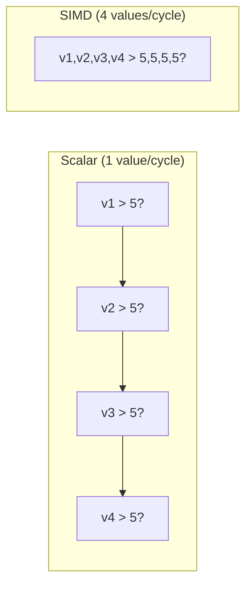

> [!NOTE] Definition
> SIMD (Single Instruction, Multiple Data) is a CPU feature that processes multiple data elements with a single instruction. Modern CPUs have wide SIMD registers (128-512 bits) that can, for example, compare 16 values against a constant in one clock cycle. This is fundamental to high-performance [[Column Store]] scan operations.

## SIMD Register Widths

| Instruction Set | Register Width | 32-bit values per op |
|---|---|---|
| SSE | 128 bits | 4 |
| AVX2 | 256 bits | 8 |
| AVX-512 | 512 bits | 16 |

## How It Works in Database Scans

A SIMD scan over a column:
1. Load $k$ values from the column into a SIMD register
2. Load the comparison constant into another register (broadcast)
3. Execute a single comparison instruction - produces a bitmask of results
4. Store or combine the result bitmask
5. Advance pointer by $k$ values and repeat

## Key Operations for Databases

- **Comparison** (`_mm256_cmpgt_epi32`): compare $k$ values against a predicate
- **Gather/Scatter**: load/store non-contiguous values
- **Bitwise operations**: combine predicate results with AND/OR
- **Horizontal aggregation**: sum/min/max across a register

> [!IMPORTANT]
> SIMD is most effective on [[Column Store]] data because values of the same type are contiguous in memory. [[Row Store]] layouts break SIMD efficiency since adjacent memory contains mixed types from different attributes.

## Requirements for SIMD Efficiency

- **Contiguous, aligned data** - columns stored as arrays
- **Fixed-width values** - enabled by [[Dictionary Encoding]]
- **No branches** - predicate evaluation should produce bitmasks, not if/else
- **Sufficient data volume** - SIMD setup cost amortized over many values

## Related Concepts

- [[Column Store]]: provides the contiguous data layout SIMD needs
- [[Vectorized Scan]]: uses SIMD for high-throughput column scans
- [[Bit-Packing Encoding]]: multiple bit-packed values fit in one SIMD register
- [[Predicate Evaluation]]: SIMD accelerates predicate checks on columns
- [[Vectorized Query Execution]]: processes data in vector-sized batches using SIMD
