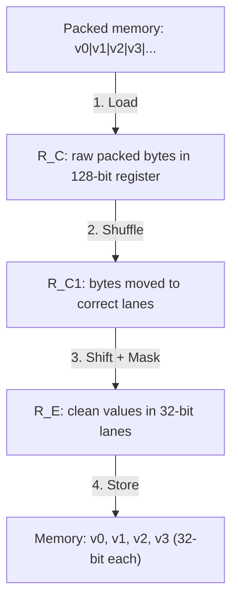

> [!NOTE] Definition
> SIMD-Scan is an algorithm for scanning [[Bit-Packing Encoding|bit-packed]] column data using SIMD instructions. It decompresses multiple bit-packed values simultaneously into SIMD lanes and can optionally apply filter predicates before writing results back to memory.

## The Problem

Bit-packed data stores values using the minimum number of bits (e.g., 9 bits per value instead of 32). This saves memory but creates challenges:
- Values are **not byte-aligned** - they cross byte boundaries
- Standard SIMD operations expect values aligned to lanes (32 or 64 bits each)
- Naive scalar decompression is slow due to branch-heavy bit manipulation

## The Four-Step Decompress Algorithm

### Step 1: Load

Load a chunk of packed bytes from memory into a 128-bit SIMD register $R_C$. The values are still packed and cross lane boundaries.

### Step 2: Shuffle (Clean)

Use a SIMD shuffle instruction (`_mm_shuffle_epi8`) to rearrange bytes so that each value's bytes are placed into the correct SIMD lane. After this step, each 32-bit lane contains the relevant bytes for one value, but possibly with extra bits from neighbors.

### Step 3: Shift

Apply per-lane shift operations to align each value within its lane and mask off extra bits. This isolates the actual $n$-bit value in each 32-bit lane.

### Step 4: Store

Store the decompressed values from the SIMD register back to memory as regular 32-bit integers.

> [!IMPORTANT]
> The shuffle and shift patterns depend on the bit-width $n$ of the packed values. These patterns are precomputed as lookup tables indexed by $n$, so the algorithm works for any bit-width without runtime computation.

## SIMD-Search: Scan with Filter

SIMD-Search extends SIMD-Scan by adding a filter step after decompression. Instead of storing all values, it evaluates a predicate directly in the SIMD register:

1. **Load, Shuffle, Shift** - same as SIMD-Scan (produces decompressed values in $R_E$)
2. **Compare** - SIMD comparison against a constant in register $R_V$: `_mm_cmpgt_epi32(R_E, R_V)`
3. **Result** - bit-mask indicating which values qualify (all 1s = hit, all 0s = miss)
4. Use the bit-mask to selectively decompress other columns ([[Late Materialization]])

This avoids writing decompressed values to memory for rows that don't match the predicate.

## Performance

SIMD-Scan significantly outperforms scalar approaches, especially at lower bit-widths where more values fit per SIMD register:

| Approach | Relative Speed |
|---|---|
| Unoptimized scalar (branching) | Baseline |
| Optimized scalar (branchless) | ~2x faster |
| SIMD-Scan (SSE 128-bit) | ~3-5x faster |
| SIMD-Scan (AVX2 256-bit) | ~6-10x faster |

> [!WARNING]
> Performance gains depend heavily on the specific CPU, instruction set, and bit-width. A 2023 study found that results vary significantly between x86 (Icelake) and ARM (Apple M1) platforms. DBMSs are often memory-bound, so SIMD gains may be limited by memory bandwidth.

## Related Concepts

- [[Bit-Packing Encoding]]: the compression scheme SIMD-Scan operates on
- [[SIMD Processing]]: the hardware feature enabling parallel decompression
- [[Vectorized Scan]]: the general concept of vectorized table scans
- [[Late Materialization]]: SIMD-Search enables selective decompression
- [[Query Processing on Compressed Data]]: operating directly on compressed representations
