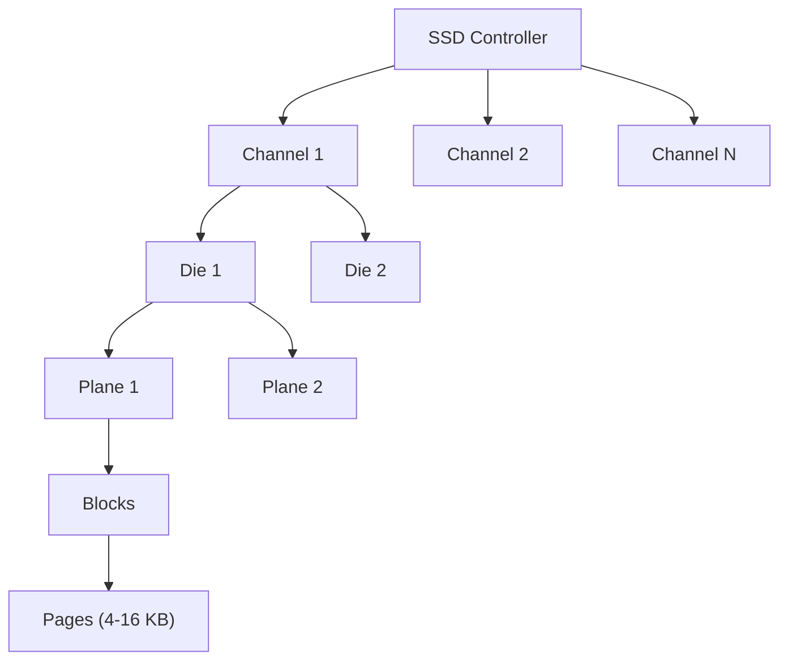

> [!NOTE] Definition
> A Solid State Drive (SSD) uses NAND flash memory chips instead of magnetic platters. Its architecture features multiple levels of internal parallelism (channels, dies, planes) and fundamentally asymmetric operations: reads are fast, writes are slower, and erases are slow and operate on large blocks.

## Internal Organization

| Level | Description |
|---|---|
| **Channel** | Independent data bus to flash chips |
| **Die/Chip** | Individual flash memory chip |
| **Plane** | Sub-unit within a die with its own page buffer |
| **Block** | Erase unit (128-256 pages, typically 256 KB - 4 MB) |
| **Page** | Read/write unit (4-16 KB) |

## NAND Flash Types

| Type | Bits/Cell | Speed | Endurance | Cost |
|---|---|---|---|---|
| SLC | 1 | Fastest | ~100K P/E cycles | Highest |
| MLC | 2 | Medium | ~10K P/E cycles | Medium |
| TLC | 3 | Slower | ~3K P/E cycles | Lower |
| QLC | 4 | Slowest | ~1K P/E cycles | Lowest |

## Asymmetric Operations

| Operation | Granularity | Latency |
|---|---|---|
| **Read** | Page (4-16 KB) | ~25-50 us |
| **Write (Program)** | Page (4-16 KB) | ~200-500 us |
| **Erase** | Block (256 KB - 4 MB) | ~1.5-3 ms |

> [!IMPORTANT]
> A page cannot be overwritten in place - it must first be erased at the block level. Since a block contains many pages, erasing affects all pages in the block. This **erase-before-write** constraint is the fundamental challenge that the [[Flash Translation Layer]] must manage.

## Internal Parallelism

SSDs achieve high bandwidth by exploiting parallelism at multiple levels:
- **Channel-level**: independent data buses operate in parallel
- **Die-level**: multiple dies per channel can be interleaved
- **Plane-level**: some operations can run on multiple planes simultaneously

This means SSDs favor large, sequential I/O patterns that can utilize all channels.

## Related Concepts

- [[Flash Translation Layer]]: manages the logical-to-physical page mapping
- [[Write Amplification]]: a key metric for SSD efficiency
- [[Wear Leveling]]: distributes writes evenly across flash cells
- [[SSD Performance Characteristics]]: read/write patterns and their implications
