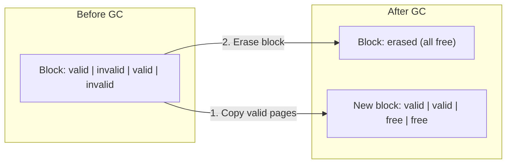

> [!NOTE] Definition
> SSD Garbage Collection (GC) is the process by which the SSD controller reclaims space occupied by invalid (stale) pages. Since NAND flash requires erasing entire blocks before rewriting, the GC must copy valid pages out of a victim block, erase it, and make its pages available for new writes.

## Why GC is Needed

Flash memory uses **out-of-place writing**: updates don't overwrite the old page but write to a new location. The old page becomes invalid. Over time, blocks accumulate a mix of valid and invalid pages.

## GC Process

1. **Select victim block** - choose a block to reclaim (typically the one with the least valid data - greedy strategy)
2. **Copy valid pages** - move still-valid pages to another block (these are GC writes)
3. **Erase victim block** - the entire block is erased, making all pages free
4. GC writes compete with host writes for SSD bandwidth

## Write Amplification from GC

$$WAF = \frac{\text{GC writes} + \text{host writes}}{\text{host writes}}$$

> [!NOTE] Example
> If the host writes 2 pages and GC must copy 2 valid pages from the victim block:
> $$WAF = \frac{2 + 2}{2} = 2$$

## GC Under Skewed Workloads

When access patterns are skewed (some pages are "hot" - updated frequently, others are "cold"):

| Workload | GC Behavior | WAF |
|---|---|---|
| **Uniform** | Greedy GC is optimal | Predictable |
| **Skewed** | Hot and cold pages mix in blocks | WAF increases on most SSDs |

With hot/cold separation (placing hot pages together): when a hot block is selected for GC, all pages are already invalid - **no valid pages to copy**:
$$WAF = \frac{0 + k}{k} = 1$$

> [!IMPORTANT]
> Most SSDs use simple greedy-like GC internally. Under skewed workloads, WAF tends to increase because hot and cold data get mixed within blocks. The main solution is **over-provisioning** (leaving SSD capacity unused) or using new interfaces like ZNS/FDP.

## Over-Provisioning and WAF

Under a uniform random workload:
$$WAF \approx \frac{1}{2 \times OP}$$

where $OP$ is the over-provisioning ratio (fraction of extra capacity).

| Over-Provisioning | WAF |
|---|---|
| $OP = 0.25$ (25%) | $\approx 2$ |
| $OP = 0.15$ (15%) | $\approx 3.3$ |
| $OP = 0.50$ (50%) | $\approx 1$ |

> [!WARNING]
> Never fill an SSD to capacity for database workloads. Higher fill levels reduce effective OP, dramatically increasing WAF. This is especially true for read-intensive SSDs that have less built-in OP.

## SSD Latency Impact

GC operations block normal I/O:
- **Read latency**: ~80 us
- **Program (write) latency**: ~1 ms
- **Erase latency**: ~3 ms

Solutions:
- **Non-volatile write cache**: absorbs writes during GC
- **Suspension**: pause program/erase to service urgent reads
- **Parallel units**: distribute GC across multiple dies/planes

## Sequential Writing: Not a Silver Bullet

Flash-friendly sequential writing (emulating ZNS) can reduce WAF, but:
- Multiple active write zones increase WAF again
- It doesn't fully solve the problem, especially under skewed access patterns

## Related Concepts

- [[Write Amplification]]: the primary metric affected by GC behavior
- [[Flash Translation Layer]]: manages the logical-to-physical mapping that drives GC
- [[Wear Leveling]]: complementary concern - GC must also distribute wear evenly
- [[SSD Architecture]]: the hardware parallelism that enables concurrent GC
- [[SSD-Aware Database Design]]: database strategies to minimize GC impact
