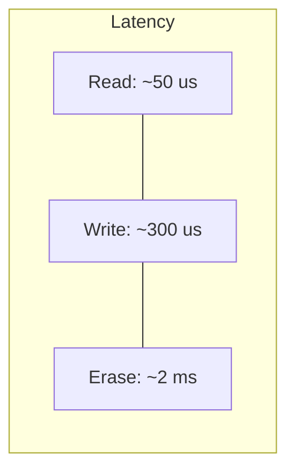

> [!NOTE] Definition
> SSDs have fundamentally different performance characteristics from HDDs. The most important differences: no seek time (random reads are fast), read/write asymmetry (reads much faster than writes), and high internal parallelism (bandwidth scales with I/O size and queue depth).

## SSD vs HDD Comparison

| Property | HDD | SSD |
|---|---|---|
| Random read latency | ~5-10 ms (seek + rotation) | ~25-100 us |
| Sequential read | ~150-200 MB/s | ~500-3500 MB/s |
| Random write latency | ~5-10 ms | ~200-500 us |
| Sequential write | ~150-200 MB/s | ~400-3000 MB/s |
| Random read IOPS | ~100-200 | ~10K-500K |
| Power consumption | ~5-10 W | ~2-5 W |
| Physical shock resistance | Low | High |

> [!IMPORTANT]
> The key insight for database design: on HDDs, **sequential access is orders of magnitude faster than random access** (due to seek time). On SSDs, **the gap between random and sequential is much smaller**, especially for reads. This changes which data structures and access patterns are optimal.

## Read/Write Asymmetry

Writes are 4-10x slower than reads because:
- Programming flash cells requires higher voltage and careful charge placement
- The [[Flash Translation Layer]] may trigger garbage collection during writes
- Write operations must be committed to the FTL mapping table

## Bandwidth and Parallelism

SSD bandwidth depends heavily on:
- **I/O size**: larger requests utilize more internal channels
- **Queue depth**: multiple outstanding requests exploit die/plane parallelism
- **Access pattern**: sequential access enables read-ahead and channel striping

At queue depth 1 with 4 KB random reads, an SSD might deliver 50 MB/s. At queue depth 32, the same SSD delivers 500+ MB/s.

## Implications for Database Design

| HDD Optimization | SSD Adaptation |
|---|---|
| Minimize random I/O | Random reads are acceptable |
| B-tree with large fan-out | Smaller nodes may be fine |
| Sequential log writes | Still beneficial (write asymmetry) |
| Large buffer pool | Smaller buffer pool possible |

## Related Concepts

- [[SSD Architecture]]: the internal structure that creates these performance characteristics
- [[Flash Translation Layer]]: its behavior directly impacts write performance
- [[Write Amplification]]: affects sustained write performance
- [[SSD-Aware Database Design]]: database strategies that exploit SSD characteristics
