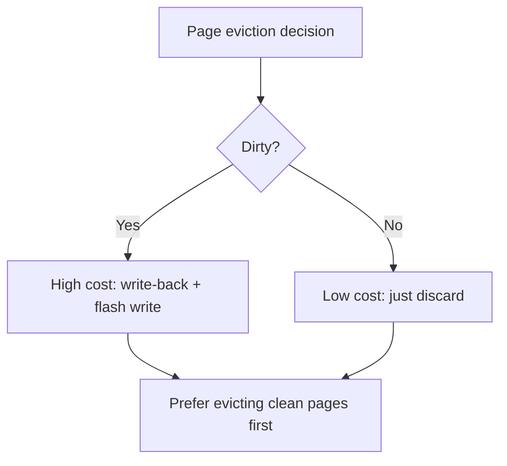

> [!NOTE] Definition
> SSD-aware database design adapts storage engines, buffer management, and data structures to exploit the unique characteristics of SSDs - fast random reads, high internal parallelism, and sequential write preference - while avoiding pitfalls like excessive [[Write Amplification]] and flash wear.

## Key Design Principles

### 1. Exploit Fast Random Reads

On HDDs, B-trees use large nodes (matching disk pages) to minimize tree height and random seeks. On SSDs, random reads are fast, so:
- **Smaller B-tree nodes** are feasible (better cache utilization)
- **More index levels** are acceptable
- **Hash indexes** become practical (random access pattern)

### 2. Minimize Random Writes

Despite fast random reads, random writes remain problematic on SSDs due to [[Write Amplification]] and the erase-before-write constraint.

| Strategy | How It Helps |
|---|---|
| **[[LSM Tree]]** | Converts random writes to sequential |
| **Write batching** | Accumulates updates, flushes sequentially |
| **Log-structured storage** | Append-only writes |
| **Copy-on-write B-trees** | Writes go to new pages, old pages invalidated |

### 3. Leverage Internal Parallelism

- Use **large I/O requests** (64 KB+) to saturate multiple channels
- Maintain **high queue depth** to keep multiple dies busy
- **Prefetch aggressively** - the bandwidth is available if you use it

### 4. SSD-Aware Buffer Management

Traditional buffer managers (LRU) assume disk access is uniformly expensive. On SSDs:
- **Read vs write cost differs** - evicting dirty pages is more expensive than clean pages
- **Random reads are cheap** - less need to keep read-only pages cached
- Prefer evicting **clean pages** to avoid write-back costs

### 5. Hot/Cold Data Separation

Separating frequently-updated (hot) data from rarely-updated (cold) data into different blocks:
- Reduces garbage collection overhead in the [[Flash Translation Layer]]
- Lowers [[Write Amplification]] (GC on hot blocks doesn't relocate cold data)

> [!IMPORTANT]
> The biggest mistake in SSD database design is treating SSDs as "fast HDDs." Their performance model is fundamentally different: reads vs writes are asymmetric, random vs sequential gap is smaller, and internal parallelism must be actively exploited.

## Related Concepts

- [[SSD Architecture]]: the hardware that motivates these design choices
- [[SSD Performance Characteristics]]: the performance model these designs target
- [[LSM Tree]]: the primary write-optimized data structure for SSDs
- [[Write Amplification]]: the key metric to minimize
- [[Flash Translation Layer]]: understanding FTL helps design SSD-friendly access patterns
