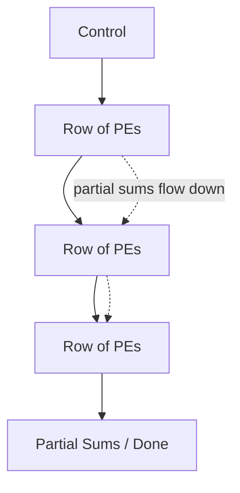

> [!NOTE] Definition
> A systolic array is a grid of simple processing elements arranged so that data flows rhythmically from one element to its neighbors, each performing a small operation (e.g., multiply-accumulate) and passing partial results onward - rather than every element independently fetching operands from a shared memory.

## Data-Driven Control

Unlike a [[Von Neumann Architecture|Von Neumann]] CPU or GPU, which uses instruction-driven control (a control unit decodes and schedules instructions over a scalar/array basis), a systolic array uses **data-driven control**: computation proceeds as data physically moves through the array, and a **tensor** (rather than a scalar) is the natural unit of computation.

Each cell in the array reads a small, fixed input once, performs its operation, and passes data to its neighbor - the software has "the illusion" that each input value is read once and instantly updates a shared set of accumulators, even though the actual physical data movement happens step by step across the grid.

## Why It's Efficient

By combining a **homogeneous** (identical processing elements) and **specialized** (fixed data flow, no general-purpose instruction decoding) architecture, systolic arrays achieve:

- **Better scalability** - the same design tiles across a larger grid
- **More efficient use of resources** - no repeated fetch from shared memory per operation
- **Higher performance per watt** than general-purpose architectures

## Use in Accelerators

Systolic arrays are the core computational structure inside Google's [[Tensor Processing Unit|TPU]], where they implement the matrix multiplication that dominates neural network inference and training workloads, such as the convolution operations in convolutional neural networks (CNNs).

## Related Concepts

- [[Tensor Processing Unit]]: uses a systolic array as its matrix-multiply unit
- [[Von Neumann Architecture]]: the instruction-driven model systolic arrays deliberately depart from
- [[Hardware Specialization Spectrum]]: systolic arrays are a key enabler of high efficiency in ASIC-class accelerators
