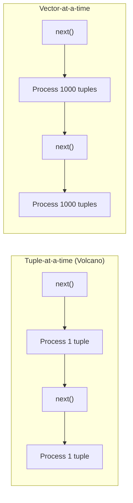

> [!NOTE] Definition
> Vectorized query execution processes data in small batches (vectors) of typically 1000-10000 values, combining the low interpretation overhead of full-column-at-a-time processing with the cache-friendly behavior of tuple-at-a-time processing. This is the execution model used by modern analytical database systems.

## Execution Models Compared

| Model | Granularity | Interpretation overhead | Cache behavior |
|---|---|---|---|
| **Tuple-at-a-time** | 1 row | High (function call per row) | Poor (data evicted between operators) |
| **Column-at-a-time** | Entire column | Minimal | Poor for large columns (exceeds cache) |
| **Vector-at-a-time** | ~1000 rows | Low (amortized over vector) | Good (vector fits in L1/L2 cache) |

## How It Works

1. Each operator maintains a `next()` interface (like Volcano/iterator model)
2. But `next()` returns a **vector** of values, not a single tuple
3. The operator processes the entire vector using tight loops and [[SIMD Processing]]
4. The vector size is chosen to fit in CPU cache

> [!IMPORTANT]
> The vector size is a critical parameter. Too small: interpretation overhead dominates. Too large: data exceeds cache, causing cache misses. The sweet spot is typically a vector that fits in L2 cache (hundreds to low thousands of values).

## Benefits

- **Amortized overhead**: function call and type-dispatch costs spread over many values
- **SIMD-friendly**: tight loops over vectors auto-vectorize or use explicit SIMD
- **Cache-friendly**: vectors fit in cache, reducing misses between operators
- **Compressed processing**: vectors can remain compressed until necessary

## Related Concepts

- [[SIMD Processing]]: vectorized execution enables effective SIMD usage
- [[Vectorized Scan]]: the scan operator in a vectorized execution engine
- [[Column Store]]: provides the columnar data that vectorized execution processes
- [[Late Materialization]]: vectors carry column segments, not reconstructed tuples
