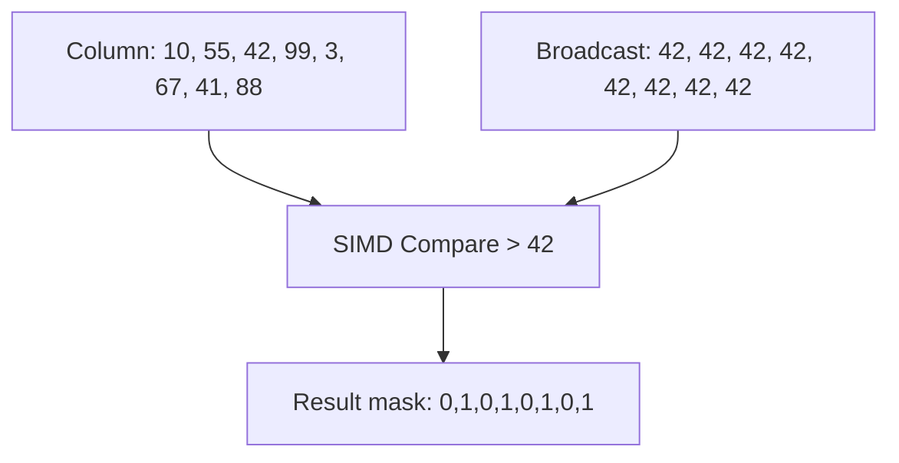

> [!NOTE] Definition
> A vectorized scan uses [[SIMD Processing]] instructions to evaluate selection predicates on a column by processing multiple values per CPU cycle. Instead of checking one value at a time, it loads a vector of values into a SIMD register and performs parallel comparisons, producing a result bitmask.

## How It Works

For predicate `WHERE col > 42` on a 32-bit integer column using AVX2 (256-bit):

1. **Broadcast** constant 42 into all 8 lanes of a SIMD register
2. **Load** 8 column values into another SIMD register
3. **Compare** with a single `_mm256_cmpgt_epi32` instruction
4. **Extract** result bitmask (8 bits, one per value)
5. **Advance** pointer by 8 values and repeat

## Performance

| Approach | Values per cycle | Speedup |
|---|---|---|
| Scalar scan | 1 | 1x |
| SSE scan (128-bit) | 4 | ~4x |
| AVX2 scan (256-bit) | 8 | ~8x |
| AVX-512 scan (512-bit) | 16 | ~16x |

> [!IMPORTANT]
> The actual speedup is often lower than the theoretical maximum due to memory bandwidth limitations. Once the scan becomes memory-bound rather than compute-bound, wider SIMD registers do not help. [[Lightweight Compression]] can alleviate this by reducing data volume.

## Bandwidth-Optimal Scan

To maximize throughput when memory bandwidth is the bottleneck:
- Keep data compressed in memory
- Decompress into SIMD registers just before comparison
- This processes more logical values per byte of memory bandwidth

## Related Concepts

- [[SIMD Processing]]: the hardware feature enabling vectorized scans
- [[Column Store]]: provides the contiguous data layout required
- [[Predicate Evaluation]]: vectorized scans are the building block for predicate evaluation
- [[Column Imprints]]: secondary index structure that can skip blocks before scanning
- [[Zone Maps]]: metadata that eliminates unnecessary scan ranges
