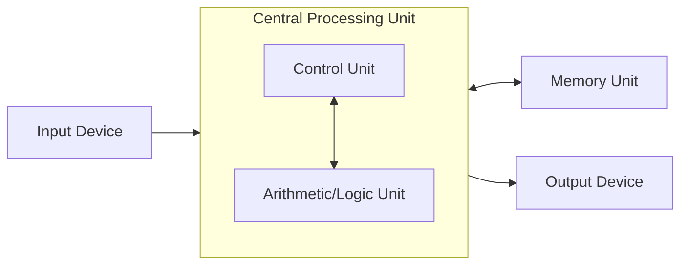

> [!NOTE] Definition
> The Von Neumann architecture describes a computer built from a Central Processing Unit (containing a Control Unit and an Arithmetic/Logic Unit), a Memory Unit that stores both instructions and data, and Input/Output devices, all connected so that instructions are fetched from memory and executed one at a time (or in bounded parallel batches).

## Structure

The defining feature is that instructions and data share the same memory and the same access path (the "Von Neumann bottleneck") - the CPU must fetch an instruction, decode it, and only then operate on data, all funneled through the same control-driven pipeline.

## Contrast with Specialized Hardware

CPUs and GPUs are both built around Von Neumann principles: computation is expressed as a sequence (or bounded-width parallel batch) of instructions, decoded and scheduled by a shared control unit. Specialized hardware like [[Systolic Array|systolic arrays]] can structure computation entirely differently - using a tensor as the basic unit of computation and data-driven control instead of instruction-driven control, which enables better scalability and efficiency for the specific class of computation they target.

## Related Concepts

- [[Hardware Specialization Spectrum]]: Von Neumann-style CPUs sit at the general-purpose end of this spectrum
- [[Systolic Array]]: an alternative, non-Von-Neumann computational structure used in accelerators
- [[Instruction-Level Parallelism]]: how modern Von Neumann CPUs extract parallelism despite the sequential instruction model
